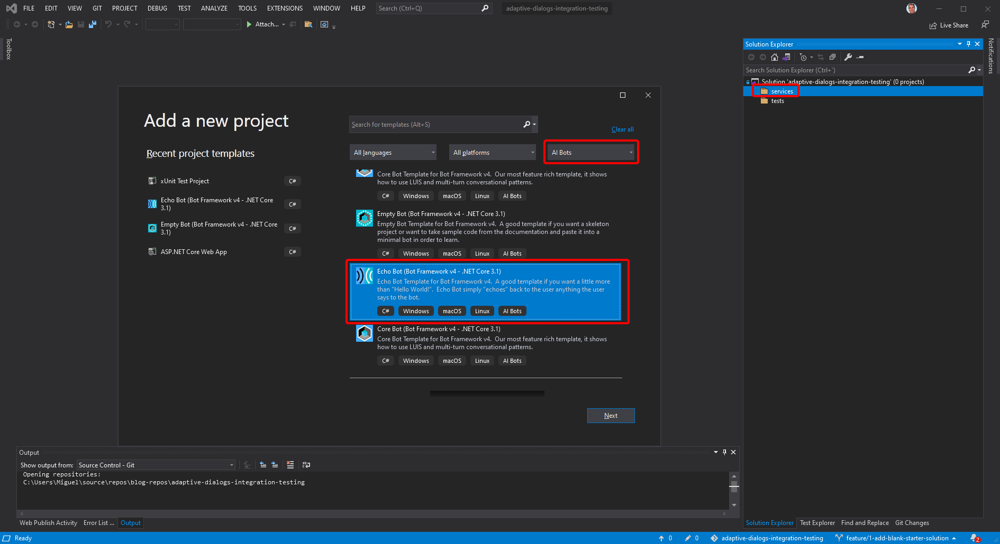
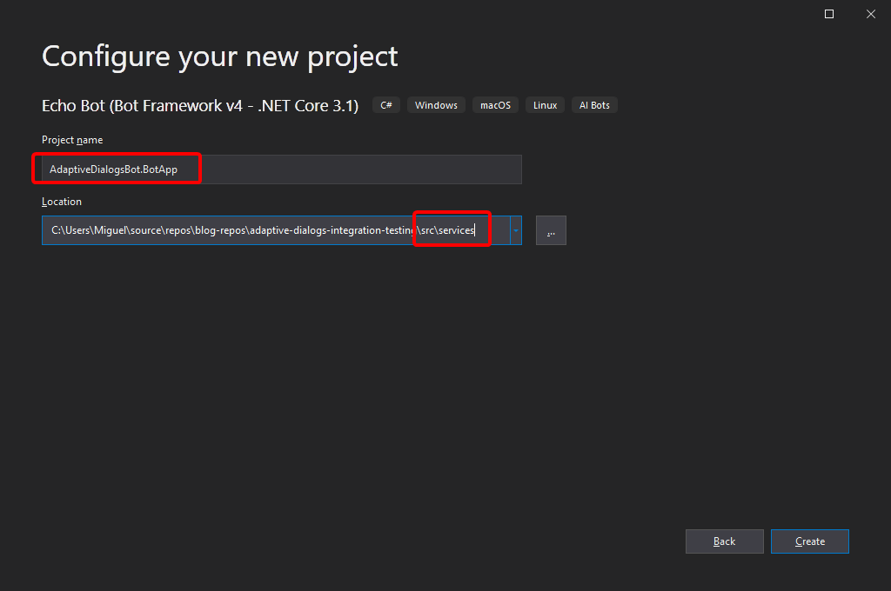
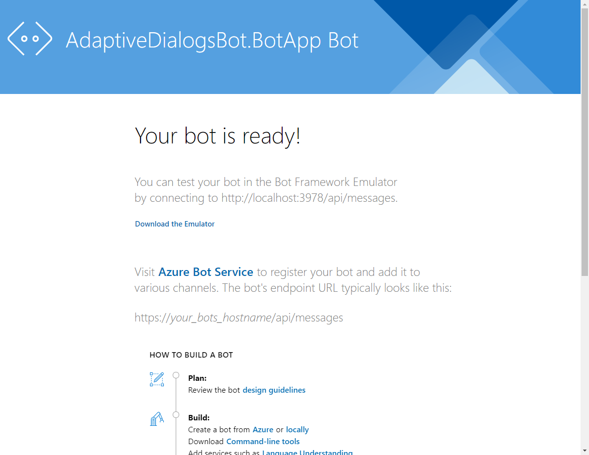
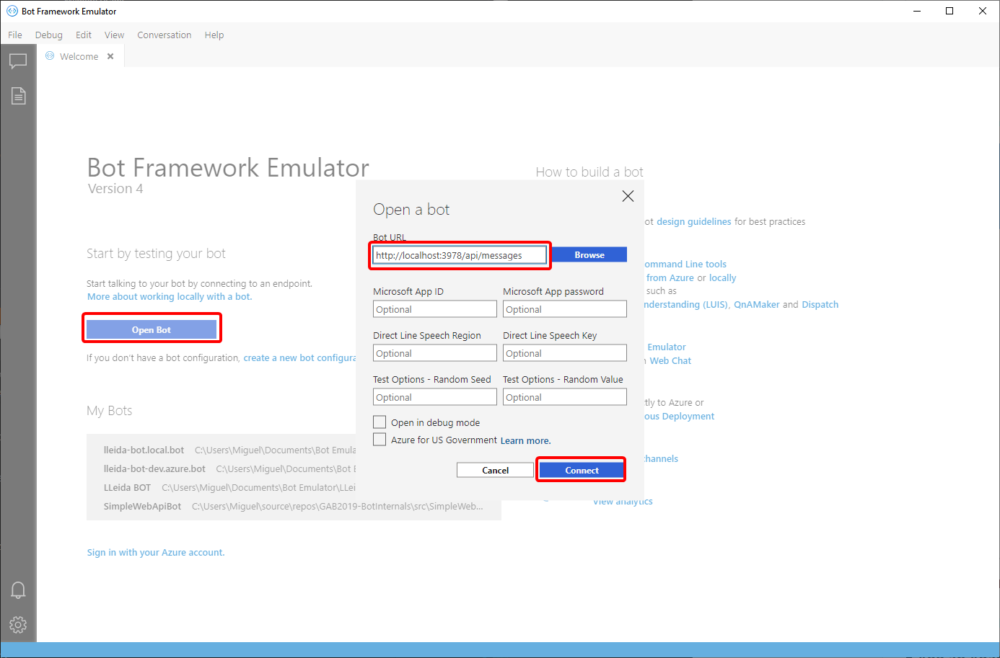
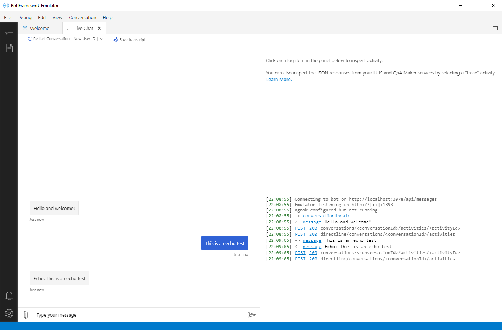
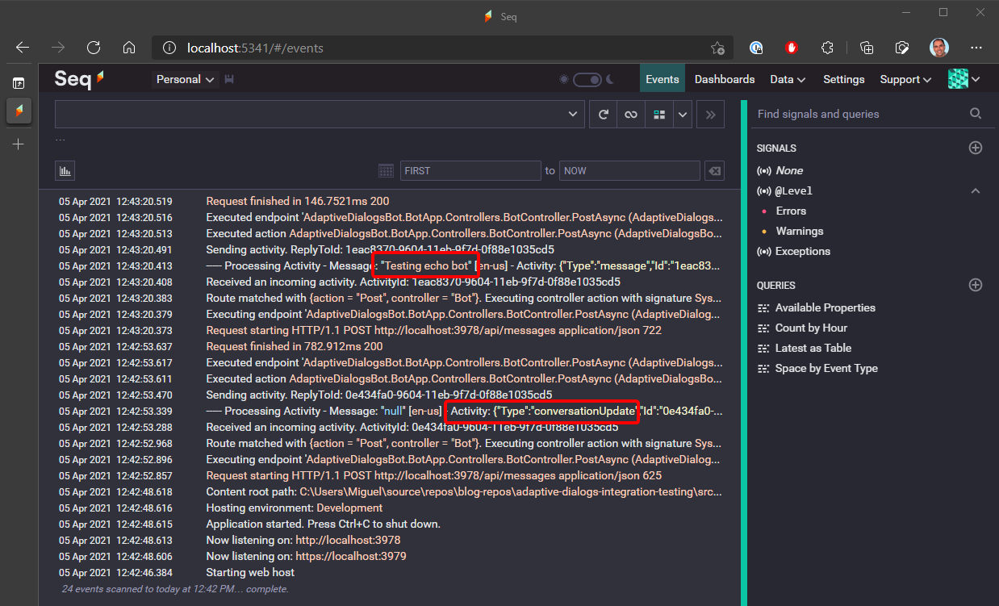
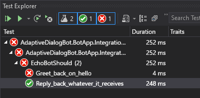

This is the first article in a series about Adaptive Dialogs in Bot Framework v4. It's an open-ended list at this point, so I'll update it as needed.

1. **Getting started with Adaptive Dialogs in Bot Framework v4** (This article)
2. [Integration Testing with Adaptive Dialogs in Bot Framework v4](/posts/integration-testing-with-adaptive-dialogs-in-bot-framework-v4)



## TL;DR;

In this article we create a simple echo bot with logging and integration testing, to set up a nice, TDD-based stage, to [convert the bot to an adaptive dialogs bot in the next post](/posts/integration-testing-with-adaptive-dialogs-in-bot-framework-v4).

We'll use logging as a learning resource, that'll help us get a better global understanding of a bot. [Serilog](https://serilog.net/) will be the log system and [Seq](https://datalust.co/seq) the centralized log server.

We begin the series with the SDK release 4.12.2 and we'll be updating it as we go along.

## Overview

[Adaptive Dialogs](https://docs.microsoft.com/azure/bot-service/bot-builder-adaptive-dialog-introduction?view=azure-bot-service-4.0) is a relatively new Bot Framework technology, it became generally available (GA) in May 2020, and allows you to define dialogs in declarative fashion. This technology also includes the powerful [Adaptive Expressions](https://docs.microsoft.com/azure/bot-service/bot-builder-concept-adaptive-expressions?view=azure-bot-service-4.0) and [Language Generation](https://docs.microsoft.com/azure/bot-service/bot-builder-concept-language-generation?view=azure-bot-service-4.0&tabs=csharp).

Besides, Adaptive Dialogs are the cornerstone of the [Bot Framework Composer](https://docs.microsoft.com/composer/introduction) but you can also use them in plain old-style code, which the way we'll get started. I expect to cover Composer at least in one post later in this series.

Adaptive Dialogs might seem a bit daunting at first, specially if you come from Bot Framework SDK v3 or before SDK v4 release 4.9 but they'll help your write a lot less boilerplate code, so you'll end up being more productive.

However, there's a catch, Adaptive Expression are string-based. That means that you'll code them as strings and you'll feel the lack of intellisense, at least in Visual Studio (there's some support for them in Visual Studio Code). You might even feel like working with Javascript in Notepad 😨. This all means you'll end up **needing** tests to make sure your bot works as expected, avoid regressions, and even to develop faster, so that's why we begin with a testing focus.

The initial article became too large, so I had to split it.

In this article we will:

- Create a simple echo bot using the [Bot Framework Templates for Visual Studio (VS)](https://marketplace.visualstudio.com/items?itemName=BotBuilder.botbuilderv4).
- Set up an integration tests project for the echo bot.

I'll be omitting the required "usings", at least most of the times. I'll also focus on the key parts of the code, you'll find all the details of each step in the repo, as separate issues, branches, and the related pull requests (PRs).

Let's get started 😀

## Implementation

### 1 - Create a simple echo bot with logging

In this step we'll create a starter bot setting up some solution folder structure to add the integration tests later on, so we'll:

1. Create a .NET Core 3.1 Echo bot
2. Add logging
3. Add a bot logging middleware

#### 1.1 - Create a .NET Core 3.1 Echo bot

##### Create a branch for the post

Clone the repo and create a branch at tag `start-01`.

##### Create a template projact

Create a new project with the "**Echo Bot (Bot Framework v4 - .NET Core 3.1)**" template on the services solution folder:

Save the project as `AdaptiveDialogsBot.BotApp` and add the `services` folder to the path to mimic the solution structure:

At this point you should be able to run the bot with the bot emulator, that you can download from the link in the web application home page:

Just check for the latest release of the emulator.

Once you have the emulator installed, open the bot at `http://localhost:3978`:

You should be able to check the bot is running and echoing back whatever you type:

#### 1.2 - Add logging

We'll use [Serilog](https://serilog.net/) for logging and [Seq](https://datalust.co/seq) as a centralized log server.

Serilog is an open source product and [Seq is available for free](https://datalust.co/pricing) for development and small deployments.

You can install Seq either [on Windows](https://docs.datalust.co/docs/getting-started) [or Docker](https://docs.datalust.co/docs/getting-started-with-docker), whatever suits you better.

Following the instructions in the [Serilog.AspNetCore GitHub repo](https://github.com/serilog/serilog-aspnetcore#instructions), with a few small changes highlighted below.

##### Install packages 

Install the following packages:

- `Serilog.AspNetCore`
- `Serilog.Sinks.Seq`
- `Destructurama.JsonNet`

Update all packages to the latest stable release, **except for the ASP.NET Core related ones**, that should be the latest 3.1.x.

##### Add Serilog and Seq to Program

Add Serilog and Seq to `Program.cs` as shown next.

Update `Main` in `Program.cs` as follows:


public static int Main(string[] args)
{
    Log.Logger = new LoggerConfiguration()
        .MinimumLevel.Override("Microsoft", LogEventLevel.Information)
        .Enrich.FromLogContext()
        .Destructure.JsonNetTypes()
        .WriteTo.Console()
        .WriteTo.Seq("http://localhost:5341")
        .CreateLogger();

    try
    {
        Log.Information("Starting web host");
        CreateHostBuilder(args).Build().Run();
        return 0;
    }
    catch (Exception ex)
    {
        Log.Fatal(ex, "Host terminated unexpectedly");
        return 1;
    }
    finally
    {
        Log.CloseAndFlush();
    }
}


In the previous code we:

- Added support to log JSon objects (**line 6**) when using the `@ObjectName` structured logging template.
- Added the Seq sink (**line 8**) to send log traces to Seq.

Next, update `CreateHostBuilder` as follows:


public static IHostBuilder CreateHostBuilder(string[] args) =>
Host.CreateDefaultBuilder(args)
    .UseSerilog()
    .ConfigureWebHostDefaults(webBuilder =>
    {
        webBuilder.UseStartup<Startup>();
    });


#### 1.3 - Add a bot logging middleware

We'll now add a simple logging middleware to the bot pipeline so we can log the activity details.

##### Create the logging middleware

Create the `LoggingMiddleware` class as follows:


using Microsoft.Bot.Builder;
using Serilog;
using System.Threading;
using System.Threading.Tasks;

namespace AdaptiveDialogsBot.BotApp
{
    public class LoggingMiddleware : IMiddleware
    {
        public async Task OnTurnAsync(ITurnContext turnContext, NextDelegate next, CancellationToken cancellationToken = default)
        {
            Log.Information("----- Processing Activity - Message: \"{Message}\" [{Locale}] - Activity: {@Activity}",
                turnContext.Activity.Text, turnContext.Activity.Locale, turnContext.Activity);

            await next.Invoke(cancellationToken);
        }
    }
}


In the code above:

- Notice we're using `IMiddleware` from the `Microsoft.Bot.Builder` namespace (**lines 1, 8**).

##### Register the new logging middleware

Register the middleware in the `AdapterWithErrorHandler` class:


public class AdapterWithErrorHandler : BotFrameworkHttpAdapter
{
    public AdapterWithErrorHandler(IConfiguration configuration, ILogger<BotFrameworkHttpAdapter> logger)
        : base(configuration, logger)
    {
        Use(new LoggingMiddleware());

        OnTurnError = async (turnContext, exception) =>
        {
            // Log any leaked exception from the application.
            logger.LogError(exception, $"[OnTurnError] unhandled error : {exception.Message}");

            // Send a message to the user
            await turnContext.SendActivityAsync("The bot encountered an error or bug.");
            await turnContext.SendActivityAsync("To continue to run this bot, please fix the bot source code.");

            // Send a trace activity, which will be displayed in the Bot Framework Emulator
            await turnContext.TraceActivityAsync("OnTurnError Trace", exception.Message, "https://www.botframework.com/schemas/error", "TurnError");
        };
    }
}


In the code above:

We add the logging middleware to the adapter pipeline (**line 6**)

##### Check the logged activities

If you run the bot and test with the emulator you should  get something like this in Seq:

You can, (should 😉), expand the traces and take a look at what an activity looks like.

### 2 - Add a bot test project

In this step we'll use ASP.NET Core's integration testing support to create the first integration test for the echo bot. So we'll:

1. Create an xUnit Test Project
2. Add the test server and other bot test-related classes
3. Add the echo test case
4. Do a little TDD

#### 2.1 - Create an xUnit Test Project

##### Create a test project

Create a new **xUnit Test Project** in the `tests` solution folder, named `AdaptiveDialogBot.BotApp.IntegrationTests`, targeting .NET Core 3.1.

Remember to add `tests` to the project path, similar to what we did before, so the folder structure mimics the solution's.

Add a reference to the `AdaptiveDialogBot.BotApp` project.

##### Install required packages

Install the following packages:

- `Microsoft.Bot.Builder.Testing`
- `Microsoft.Extensions.DependencyInjection`
- `FluentAssertions`

Update all packages to the latest stable release, except for the ASP.NET Core related ones, that should be the latest 3.1.x.

##### Create the initial test class

Move the initial test class to a new `EchoBotTests` folder.

Rename the test class to `EchoBotShould` and update it so it looks like this:


using System;
using System.Threading.Tasks;
using Xunit;

namespace AdaptiveDialogBot.BotApp.IntegrationTests.EchoBotTests
{
    public class EchoBotShould
    {
        [Fact]
        public async Task Reply_back_whatever_it_receives()
        {
            // Arrange -----------------

            // Act ---------------------

            // Assert ------------------

        }
    }
}


#### 2.2 - Add test server and bot test-related classes

We'll roughly follow the [Integration tests in ASP.NET Core](https://docs.microsoft.com/aspnet/core/test/integration-tests) official article on integration tests, and some "old" testing classes from the Bot Framework.

##### Create a specialized TestAdapter

Create the `Helpers` folder.

Create the `BotApplicationTestAdapter` class in the `Helper` folder with this code:


public class BotApplicationTestAdapter : TestAdapter
{
    public BotApplicationTestAdapter(
        ILogger<BotApplicationTestAdapter> logger)
    {
        Use(new LoggingMiddleware());

        OnTurnError = async (turnContext, exception) =>
        {
            // Log any leaked exception from the application.
            logger.LogError(exception, $"[OnTurnError] unhandled error : {exception.Message}");

            // Send a message to the user
            await turnContext.SendActivityAsync("The bot encountered an error or bug.");
            await turnContext.SendActivityAsync("To continue to run this bot, please fix the bot source code.");

            // Send a trace activity, which will be displayed in the Bot Framework Emulator
            await turnContext.TraceActivityAsync("OnTurnError Trace", exception.Message, "https://www.botframework.com/schemas/error", "TurnError");
        };

    }
}


In the code above:

- You can see that in looks just like the `AdapterWithErrorHandler` that we use in the bot project, only this one inherits from `TestAdapter` (**line 1**).
- It's using the same logging middleware (**line 6**), because we also want to log the test runs.

##### Create a specialized WebApplicationFactory

Create the `BotApplicationFactory` class in the same `Helpers` folder with the following code:


public class BotApplicationFactory : WebApplicationFactory<Startup>
{
    private bool _serverStarted;
    private bool _disposed;

    protected override IHost CreateHost(IHostBuilder builder)
    {
        Log.Logger = new LoggerConfiguration()
            .MinimumLevel.Override("Microsoft", LogEventLevel.Information)
            .Enrich.FromLogContext()
            .Destructure.JsonNetTypes()
            .WriteTo.Console()
            .WriteTo.Seq("http://localhost:5341")
            .CreateLogger();

        builder.UseSerilog();

        builder.ConfigureServices(services =>
        {
            services.AddSingleton<TestAdapter, BotApplicationTestAdapter>();
        });

        return base.CreateHost(builder);
    }

    public IServiceScope CreateScope()
    {
        EnsureServerStarted();
        return Services.CreateScope();
    }

    protected override void Dispose(bool disposing)
    {
        if (_disposed) return;

        if (disposing)
        {
            Log.CloseAndFlush();
        }

        _disposed = true;

        base.Dispose(disposing);
    }

    private void EnsureServerStarted()
    {
        if (_serverStarted) return;

        CreateClient();
        _serverStarted = true;
    }
}


In the code above you can see that:

- We're inheriting from `WebApplicationFactory` referencing the bot project `Startup` class (**line 1**). This allows us to use the original `Startup` configurations, and change them here testing.
- Since we don't run any code from `Program.cs` we have to add the logging-related code here (**lines 8-16**)
- We're are registering the new `BotApplicationTestAdapter` (**line 20**).
- We're creating the `CreateScope` method (**line 26**), that we'll use in the tests methods to get classes from the DI container.
- Again, since we don't run any `Program.cs` we have to ensure the log cache is flushed when the test completes (**line 38**), otherwise you'll lose log traces.

##### Set up some test class infrastructure

Update the initial test class as follows:


public class EchoBotShould : IClassFixture<BotApplicationFactory>, IDisposable
{
    private bool _disposedValue;
    private readonly IServiceScope _scope;

    public EchoBotShould(BotApplicationFactory applicationFactory)
    {
        _scope = applicationFactory.CreateScope();
    }

    [Fact]
    public async Task Reply_back_whatever_it_receives()
    {
        // Arrange -----------------

        // Act ---------------------

        // Assert ------------------

    }

    private T GetService<T>() => _scope.ServiceProvider.GetRequiredService<T>();

    protected virtual void Dispose(bool disposing)
    {
        if (!_disposedValue)
        {
            if (disposing)
            {
                _scope.Dispose();
            }

            _disposedValue = true;
        }
    }

    public void Dispose()
    {
        // Do not change this code. Put cleanup code in 'Dispose(bool disposing)' method
        Dispose(disposing: true);
        GC.SuppressFinalize(this);
    }
}


In the code above:

- We set up the test class to accept a `BotApplicationFactory` in the constructor, [injected as a class fixture by the test framework](https://xunit.net/docs/shared-context#class-fixture) (**line 1**).
- We create a DI scope in the constructor (**line 8**), so we can use the DI container.
- The class is created as `IDisposable` (**line 1**) so we properly dispose the DI scope (**line 30**) using the [Dispose pattern](https://docs.microsoft.com/dotnet/standard/garbage-collection/implementing-dispose).

#### 2.3 - Add the initial echo test case

So we finally update the test class to include the actual test case, as follows:


[Fact]
public async Task Reply_back_whatever_it_receives()
{
    // Arrange -----------------
    var testAdapter = GetService<TestAdapter>();
    testAdapter.Locale = "en-us";

    var bot = GetService<IBot>();
    var testFlow = new TestFlow(testAdapter, bot);

    // Act ---------------------
    await testFlow
        .SendConversationUpdate()
        .AssertReply("Hello and welcome!")
        .Send("Echo TEST!")
        .AssertReply(activity => activity.AsMessageActivity().Text.Should().Be("Echo: Echo TEST!"))
        .StartTestAsync();

    // Assert ------------------
}


In the previous code:

- The `TestAdapter` is obtained from the DI container (**line 5**).
- The `EchoBot` is obtained from the DI container (**line 8**).
- The whole "conversation" is configured with some `TestFlow` methods (**lines 12-16**).
- You can do simple reply assertions (**line 14**).
- And you can also do any complex validation with a lambda function or a delegate (**line 16**).

#### 2.4 - Do a little TDD

So now that we have the whole test infrastructure set up, let's do some [Test Driven Development](https://en.wikipedia.org/wiki/Test-driven_development) (TDD).

##### Create a failing test

Let's create a new test case as follows:


[Fact]
public async Task Greet_back_on_hello()
{
    // Arrange -----------------
    var testAdapter = GetService<TestAdapter>();
    testAdapter.Locale = "en-us";

    var bot = GetService<IBot>();
    var testFlow = new TestFlow(testAdapter, bot);

    // Act ---------------------
    await testFlow
        .SendConversationUpdate()
        .AssertReply("Hello and welcome!")
        .Send("Hello")
        .AssertReplyOneOf(new[] { 
            "Good morning",
            "Good afternoon",
            "Good evening"
        })
        .StartTestAsync();

    // Assert ------------------
}


This should be pretty obvious, so no details on the code above 😉

If you run the tests now you should get this:

##### Implement the code to pass the test

By adding just a little code to the bot you can make the test pass:


public class EchoBot : ActivityHandler
{
    protected override async Task OnMessageActivityAsync(ITurnContext<IMessageActivity> turnContext, CancellationToken cancellationToken)
    {
        string replyText;

        if (turnContext.Activity.Text.Equals("Hello", StringComparison.OrdinalIgnoreCase))
        {
            var now = DateTime.Now.TimeOfDay;

            var time = now < new TimeSpan(12, 0, 0)
                ? "morning"
                : now > new TimeSpan(19, 0, 0)
                    ? "evening"
                    : "afternoon";

            replyText = "Good " + time;
        }
        else
        {
            replyText = $"Echo: {turnContext.Activity.Text}";
        }

        await turnContext.SendActivityAsync(MessageFactory.Text(replyText, replyText), cancellationToken);
    }

    //...
}


Again, pretty simple 😃

## Takeaways

In this post we've learned how to:

- Create simple echo bot using the standard Bot Framework Templates for Visual Studio.
- Add basic logging to the bot web application.
- Set up basic integration tests for the bot, using ASP.NET Core integration testing classes.

I Hope you've found this post interesting and useful, and invite you to [follow me on Twitter](https://www.twitter.com/mvelosop) for posts and news.

See the [next article](/posts/integration-testing-with-adaptive-dialogs-in-bot-framework-v4) in the series to learn how to convert this bot to an Active Dialogs bot, using Adaptive Expressions, Language Generation, and a simple Regex recognizer.

You are also welcomed to leave a comment or ask a question [in the comments section below](#disqus_thread).

**Happy coding!**
