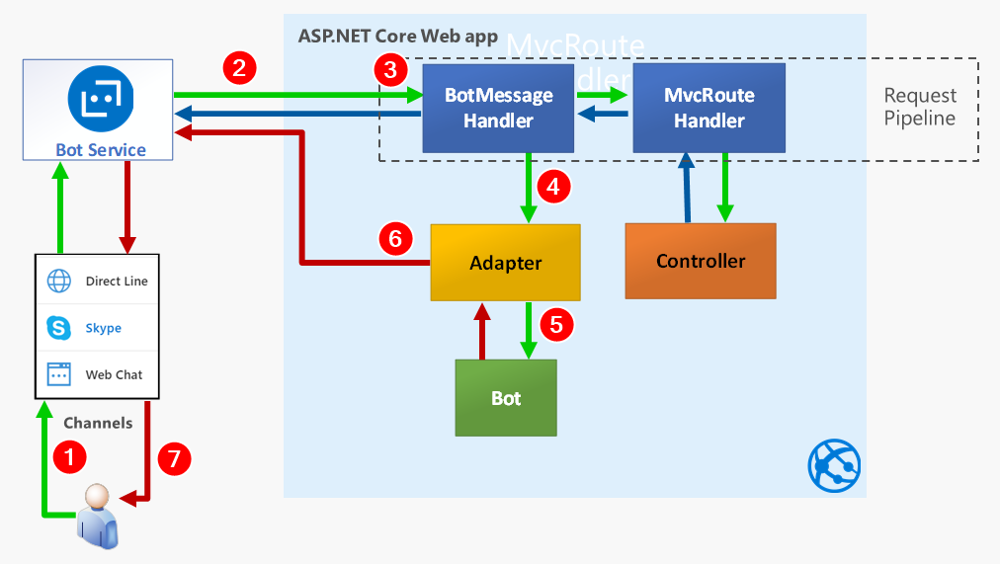
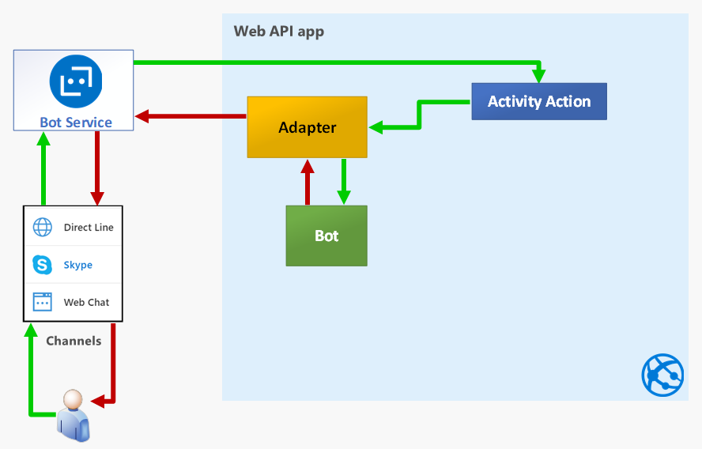
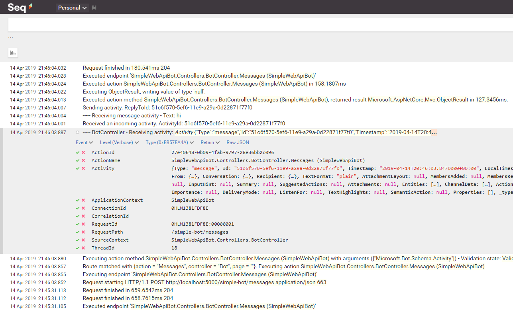

This is the first in a five-post series, where we explore the Bot Builder C# SDK v4:

1. **How does a Bot Builder v4 bot work?** (this article)
2. [How to send proactive messages with Bot Builder v4?](/posts/how-to-send-proactive-message-bot-builder-v4)
3. [How to receive events in a Bot Framework SDK v4 Web API bot?](/posts/how-to-receive-events-bot-framework-sdk-v4-web-api-bot)
4. [How to test a Bot Framework SDK v4 bot?](/posts/how-to-test-bot-framework-sdk-v4-bot)
5. [How to do integration testing for a Bot Framework SDK v4 event bot?](/posts/how-to-do-integration-testing-bot-framework-v4-event-bot/)

In this post we explore the core fundamentals of the messages flow inside a bot developed with Bot Builder C# SDK v4.

The new v4 paradigm arguably makes it easier to create a bot than v3, but the introduced change might represent an important barrier if you're coming from v3.

One significant change is the departure from the familiar Web API paradigm, however, as we'll see in this article, that apparent departure is not really that large and you can actually still use a Web API approach.

The Bot Builder C# SDK is built on top of ASP.NET Core so we'll develop a simple bot as a Web API app, and by going this way we'll realize it's actually quite simple.

So let's get into the details.

**WARNING:** The code shown here is experimental and has not been tested in production, so handle with care!



## Overview

The following diagram shows a simplified flow of messages during an interaction with a bot.



And these are the most important steps:

1. When users types some text in their device, it's sent through a channel to the Azure Bot Service.

2. The Azure Bot Service creates an `Activity` and sends a post request to your ASP.NET Core bot application.

3. The request enters the "request pipeline" where several Middleware components are registered and one of them is the `BotMessageHandler`, that "intercepts" requests to `/api/messages` to handle them. The `MvcRoutHandler` is another middleware that can be registered in the request pipeline with the `app.UseMvc()` method in the `Startup.Configure` method.

4. The `BotMessageHandler` requests instances of the `BotFrameworkAdapter` and the `IBot` to Dependency Injection and calls the `BotFrameworkAdapter` to process the `Activity`.

5. The `BotFrameworkAdapter` creates a `TurnContext` and calls the bot handler method (`OnTurnAsync`) to process the `Activity`.

6. While processing the activity, the bot can send back as many activities as needed to the Bot Service, through the adapter. Each one of this activities is a request to a channel's `ServiceUrl` in the Bot Service.

7. The user can see each activity message immediately.

It's important to highlight that the adapter can send a message through the Bot Service at any time, as long as it knows the channel's `ServiceUrl` and the conversation that must receive the message.

The following diagram shows the general approach we'll use in this article:

Instead of the Bot Framework's `BotFrameworkAdapter` we'll use a simple "activity action", in a regular MVC controller, to receive the POST request from the Bot Service and then do the equivalent of step 4 in the above to process, as shown in the next diagram.



## Implementation details

So, with this knowledge in hand, we'll now implement what's probably the simplest Web API bot you can make.

This will be a plain **EchoBot**, similar to the [published v4 sample](https://github.com/Microsoft/BotBuilder-Samples/tree/master/samples/csharp_dotnetcore/02.a.echo-bot), but implemented as a Web API app.

So, to begin with, you create an ASP.NET Core Web API app, without any authentication or https. Then make a few changes outlined here:

- Drop the initial controller (`ValuesController`).
- Create a `BotController` that will be our controller-based bot.
- Create a home Razor page as the home (`Pages/Index.cshtml`).
- Register an adapter factory while configuring the DI container in `Startup.cs`.
- Update `Program.cs` to add logging with [Serilog](https://serilog.net/) + [Seq](https://datalust.co/seq), to make it easier to explore the inner workings of our bot.

In the following sections we'll review the details of the important code here, you can explore the rest in the [GAB2019-BotInternals GitHub repo](https://github.com/mvelosop/GAB2019-BotInternals).

### Create BotController.cs

This the code for the simplest api controller that's able to process messages from the Bot Service (or the Bot Emulator):


[ApiController]
public class BotController : ControllerBase
{
    private readonly ILogger<BotController> _logger;
    private readonly IAdapterIntegration _adapter;

    public BotController(
        ILogger<BotController> logger,
        IAdapterIntegration adapter)
    {
        _logger = logger ?? throw new ArgumentNullException(nameof(logger));
        _adapter = adapter ?? throw new ArgumentNullException(nameof(adapter));
    }

    [HttpPost("/simple-bot/messages")]
    public async Task<InvokeResponse> Messages([FromBody]Activity activity)
    {
        _logger.LogTrace("----- BotController - Receiving activity: {@Activity}", activity);

        return await _adapter.ProcessActivityAsync(string.Empty, activity, OnTurnAsync, default);
    }

    private async Task OnTurnAsync(ITurnContext turnContext, CancellationToken cancellationToken)
    {
        if (turnContext.Activity.Type == ActivityTypes.Message)
        {
            var text = turnContext.Activity.Text.Trim();

            _logger.LogInformation("----- Receiving message activity - Text: {Text}", text);

            // Echo back to the user whatever they typed.
            await turnContext.SendActivityAsync($"You typed \"{text}\"");
        }
        else
        {
            await turnContext.SendActivityAsync($"{turnContext.Activity.Type} event detected");
        }
    }
}


In the code above:

- Request the adapter type, an `IAdapterIntegration`, from Dependency Injection (DI) (**line 9**).

- Receive the activity from the request body (**line 16**).

- Send the activity to the adapter's `ProcessActivityAsync` method (**line 20**), passing the method `OnTurnAsync`, that's defined right there in the controller, as the handler of the activity (**line 23**). You may recognize this method just like the core method in any bot, and you can name it whatever you like.

- Get the text sent by the user (**line 27**).

- Send it back through the `TurnContext.SendActivity` method (**line 32**).

It's important to highlight here that, if you wanted to use a regular v4 `IBot` here, you'd only have to inject the bot and pass its `OnTurnAsync` method to the `ProcessActivityAsync` method like so:

```cs
return await _adapter.ProcessActivityAsync(string.Empty, activity, _bot.OnTurnAsync, default);
```

And then delete lines 23-38, as we'll see that in the next article.

To try out your simple bot, you also have to register the required types in the DI container, in `Startup.cs`, as shown next.

### Register a BotFrameworkAdapter factory in the DI container

This is also the simplest possible adapter, without any type of authentication or adapter middleware, so it's only usable with the Bot Emulator.


public void ConfigureServices(IServiceCollection services)
{
    services.AddMvc().SetCompatibilityVersion(CompatibilityVersion.Version_2_2);

    services.AddSingleton<IAdapterIntegration>(sp => 
    {
        var logger = sp.GetRequiredService<ILogger<BotController>>();

        var adapter = new BotFrameworkAdapter(
            credentialProvider: new SimpleCredentialProvider(),
            logger: logger);

        adapter.OnTurnError = async (context, exception) =>
        {
            logger.LogError(exception, "----- SimpleWebApiBot ERROR");
            await context.SendActivityAsync("Sorry, it looks like something went wrong.");
        };

        return adapter;
    });
}


In the code above:

- The `BotFrameworkAdapter` is registered as a singleton (**line 5**).

- The `SimpleCredentialProvider` doesn't need username or password (**line 10**), because we'll be using the Bot Emulator.

### Setting up logging with Serilog + Seq

Now we'll add logging, as a good practice in general, and also as a nice way to explore the processes and variables.

[Serilog](https://serilog.net/) and [Seq](https://getseq.net/) make a great combination for [structured logging](https://nblumhardt.com/2016/06/structured-logging-concepts-in-net-series-1/) and viewing.

Serilog is an [open source project in GitHub](https://github.com/serilog/serilog) and even though Seq is not, it's possible to [use it for free for development and small projects](https://getseq.net/Pricing).

To use **Serilog** you just have to install a few packages that you can see in  `SimpleWebApiBot.csproj`.

To use **Seq** you have two options to install the product:

1. Locally in your development machine

2. In a Docker container

If you can assign 2 GB to Docker, I recommend the second option. In this case you just need to:

1. Install Docker with the default configuration (using Linux containers) and

2. Create the following batch file to install and run Seq with Docker in a single operation:

```cmd
docker start seq
if errorlevel 1 docker run --name seq -d -e ACCEPT_EULA=Y -p 5341:80 datalust/seq:latest
rem wait for 5 seconds
ping -n 5 127.0.0.1 > nul
start http://localhost:5341/#/events?deletionEnabled
```

You can get the details to install Seq locally in [Seq's documentation site](https://docs.getseq.net/docs/getting-started).

#### Explore the logs

Once you change `Program.cs` to the code in the repo, you should be able to use Seq to view the bot's events, and it should look similar to the following:



And this is an excellent tool to explore in detail the internals of your applications.

The code in `Startup.cs` in the repo, also registers a `SerilogMiddleware`, that logs directly from the ASP.NET Core pipeline, that also gives you some additional insights.

### Test with the Bot Emulator

Now you're ready to test the bot and you just have to:

- Run your Web API app with [Ctrl+F5] or [F5] to inspect with the debugger and

- Open the file `SimpleWebApiBot.bot` with the [Bot Emulator](https://docs.microsoft.com/en-us/azure/bot-service/bot-service-debug-emulator?view=azure-bot-service-4.0) and send a message to your bot.

## Takeaways

To summarize, in this post we've learned:

- The core working principles of the Bot Builder v4.
- To use a standard Web API controller to implement a bot, using only the BotFrameworkAdapter from the Bot Builder v4.
- To set up and use logging with Serilog and Seq.

I Hope you've found this post interesting and useful. [Follow me on Twitter](https://www.twitter.com/mvelosop) for more posts.

You are also welcomed to leave a comment or ask a question [in the comments section below](#disqus_thread).

**Happy coding!**

> **Resources**
>
> - Code repository in GitHub\
>   <https://github.com/mvelosop/GAB2019-BotInternals>
>
> - Bot Builder v4 samples\
>   <https://github.com/Microsoft/BotBuilder-Samples/tree/master/samples/>
>
> - Bot Emulator\
>   <https://docs.microsoft.com/azure/bot-service/bot-service-debug-emulator>
>
> - Serilog\
>   <https://serilog.net/>
>
> - Seq\
>   <https://datalust.co/seq>
>
> - Seq development and small projects licensing\
>   <https://datalust.co/Pricing>
>
> - Structured Logging blog post\
>   <https://nblumhardt.com/2016/06/structured-logging-concepts-in-net-series-1/>
