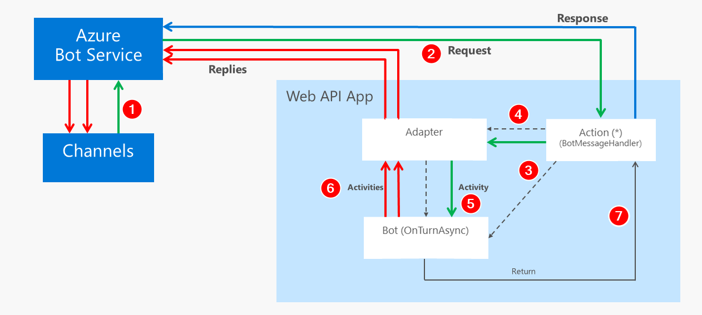

In this post we explore the core fundamentals of the messages flow inside a bot developed with Bot Builder C# SDK v4.

The new v4 paradigm arguably makes it easier to create a bot than v3, but the introduced change might represent an important barrier if you're coming from v3.

One significant change is the departure from the familiar Web API paradigm, however, as we'll see in this article, that apparent departure is not really that large and you can actually still use a WEB API approach.

The Bot Builder C# SDK is built on top of ASP.NET Core so we'll develop a simple bot as a Web API app, and by going this way we'll realize it's actually quite simple.

So let's get into the details.



## Messaging Overview

The following diagram shows a simplified flow of messages during an interaction with a bot.



And these are the most important steps:

1. When users types some text in their device, it's sent through a channel to the Azure Bot Service.

2. The Azure Bot Service creates an `Activity` and posts it to your bot application.

3. A `BotMessageHandler` (equivalent to a controller action) creates an instance of the bot and...

4. Asks the `BotFrameworkAdapter` to process the `Activity`.

5. The `BotFrameworkAdapter` creates a `TurnContext` and calls the bot handler method (`OnTurnAsync`) to process the `Activity`.

6. While processing the activity, the bot can send back many activities to the Bot Service, through the adapter, and the user can see them immediately.

7. When the bot handler method finishes, the response is sent back to the Bot Service and the interaction is finished.

So this means we can summarize the typical user interaction for a bot app as:

- **request -> replies -> response**

Instead of the **request -> response** of a typical web app.

But, in this case it's the **replies** that convey the important information back to the user.

It's important to keep in mind that the adapter has constant communication with the Bot Service, so it can send a message to the user at any time, without the need for an initial request.

## The simplest Web API bot

So, with this knowledge in hand, we'll now implement what's probably the simplest Web API bot you can make.

This will be a plain **EchoBot**, similar to the [published v4 sample](https://github.com/Microsoft/BotBuilder-Samples/tree/master/samples/csharp_dotnetcore/02.a.echo-bot), but implemented as a Web API app.

So, to begin with, you create an ASP.NET Core Web API app, without any authentication or https. Then make a few changes outlined here:

- Drop the initial controller (`ValuesController`).
- Create a `BotController` that will be our controller-based bot.
- Create a home Razor page as the home (`Pages/Index.cshtml`).
- Register an adapter factory while configuring the DI container in `Startup.cs`.
- Update `Program.cs` to add logging with [Serilog](https://serilog.net/) + [Seq](https://datalust.co/seq), to make it easier to explore the inner workings of our bot.

In the following sections we'll review the details of the important code here, you can explore the rest in the [GAB2019-BotInternals GitHub repo](https://github.com/mvelosop/GAB2019-BotInternals).

### Create BotController.cs

This the code for the simplest api controller that's able to process messages from the Bot Service (or the Bot Emulator):


[ApiController]
public class BotController : ControllerBase
{
    private readonly ILogger<BotController> _logger;
    private readonly IAdapterIntegration _adapter;

    public BotController(
        ILogger<BotController> logger,
        IAdapterIntegration adapter)
    {
        _logger = logger ?? throw new ArgumentNullException(nameof(logger));
        _adapter = adapter ?? throw new ArgumentNullException(nameof(adapter));
    }

    [HttpPost("/simple-bot/messages")]
    public async Task<InvokeResponse> Messages([FromBody]Activity activity)
    {
        _logger.LogTrace("----- BotController - Receiving activity: {@Activity}", activity);

        return await _adapter.ProcessActivityAsync(string.Empty, activity, OnTurnAsync, default);
    }

    private async Task OnTurnAsync(ITurnContext turnContext, CancellationToken cancellationToken)
    {
        if (turnContext.Activity.Type == ActivityTypes.Message)
        {
            var text = turnContext.Activity.Text.Trim();

            _logger.LogInformation("----- Receiving message activity - Text: {Text}", text);

            // Echo back to the user whatever they typed.
            await turnContext.SendActivityAsync($"You typed \"{text}\"");
        }
        else
        {
            await turnContext.SendActivityAsync($"{turnContext.Activity.Type} event detected");
        }
    }
}


The important lines above are the following:

- Request the adapter type, an `IAdapterIntegration`, from Dependency Injection (DI) (**line 9**).

- Receive the activity from the request body (**line 16**).

- Send the activity to the adapter's `ProcessActivityAsync` method (**line 20**), passing the method `OnTurnAsync`, that's defined right there in the controller, as the handler of the activity (**line 23**). You may recognize this method just like the core method in any bot, and you can name it whatever you like.

- Get the text sent by the user (**line 27**).

- Send it back through the `TurnContext.SendActivity` method (**line 32**).

It's important to highlight here that, if you wanted to use a regular v4 `IBot` here, you'd only have to inject the bot and pass its `OnTurnAsync` method to the `ProcessActivityAsync` method like so:

```cs
return await _adapter.ProcessActivityAsync(string.Empty, activity, _bot.OnTurnAsync, default);
```

And then delete lines 23-38, as we'll see that in the next article.

To try out your simple bot, you also have to register the required types in the DI container, in `Startup.cs`, as shown next.

### Register a BotFrameworkAdapter factory in the DI container

This is also the simplest possible adapter, without any type of authentication or adapter middleware, so it's only usable with the Bot Emulator.


public void ConfigureServices(IServiceCollection services)
{
    services.AddMvc().SetCompatibilityVersion(CompatibilityVersion.Version_2_2);

    services.AddSingleton<IAdapterIntegration>(sp => 
    {
        var logger = sp.GetRequiredService<ILogger<BotController>>();

        var adapter = new BotFrameworkAdapter(
            credentialProvider: new SimpleCredentialProvider(),
            logger: logger);

        adapter.OnTurnError = async (context, exception) =>
        {
            logger.LogError(exception, "----- SimpleWebApiBot ERROR");
            await context.SendActivityAsync("Sorry, it looks like something went wrong.");
        };

        return adapter;
    });
}


In this case it's important to highlight that:

- The `BotFrameworkAdapter` is registered as a singleton (**line 5**).

- The `SimpleCredentialProvider` doesn't use username or password (**line 10**).

### Setting up logging with Serilog + Seq

Now we'll add logging, as a good practice in general, and also as a nice way to explore the processes and variables.

[Serilog](https://serilog.net/) and [Seq](https://getseq.net/) make a great combination for [structured logging](https://nblumhardt.com/2016/06/structured-logging-concepts-in-net-series-1/) and viewing.

Serilog is an [open source project in GitHub](https://github.com/serilog/serilog) and even though Seq is not, it's possible to [use it for free for development and small projects](https://getseq.net/Pricing).

To use **Serilog** you just have to install a few packages that you can see in  `SimpleWebApiBot.csproj`.

To use **Seq** you have two options to install the product:

1. Locally in your development machine

2. In a Docker container

If you can assign 2 GB to Docker, I recommend the second option. In this case you just need to:

1. Install Docker with the default configuration (using Linux containers) and

2. Create the following batch file to install and run Seq with Docker in a single operation:

```cmd
docker start seq
if errorlevel 1 docker run --name seq -d -e ACCEPT_EULA=Y -p 5341:80 datalust/seq:latest
rem wait for 5 seconds
ping -n 5 127.0.0.1 > nul
start http://localhost:5341/#/events?deletionEnabled
```

You can get the details to install Seq locally in [Seq's documentation site](https://docs.getseq.net/docs/getting-started).

#### Explore the logs

Once you change `Program.cs` to the code in the repo, you should be able to use Seq to view the bot's events, and it should look similar to the following:


And this is an excellent tool to explore in detail the internals of your applications.

The code in `Startup.cs` in the repo, also registers a `SerilogMiddleware`, that logs directly from the ASP.NET Core pipeline, that also gives you some additional insights.

## Conclusions

So, we got to see that a **Bot Builder v4** bot can be implemented as a simple ASP.NET Core Web API project, and that opens the door to easily implement some interesting scenarios, such as sending proactive messages without using a Direct Line client or interfacing directly to an Alexa skill.

We'll see some of this in the next article, so stay tuned and [follow me on Twitter](https://twitter.com/mvelosop).

Hope this helps you.

Happy coding!