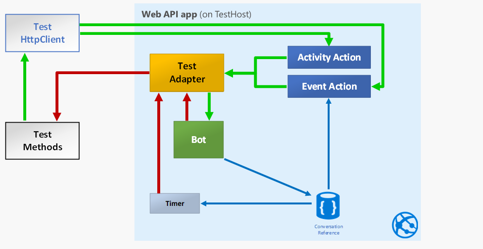
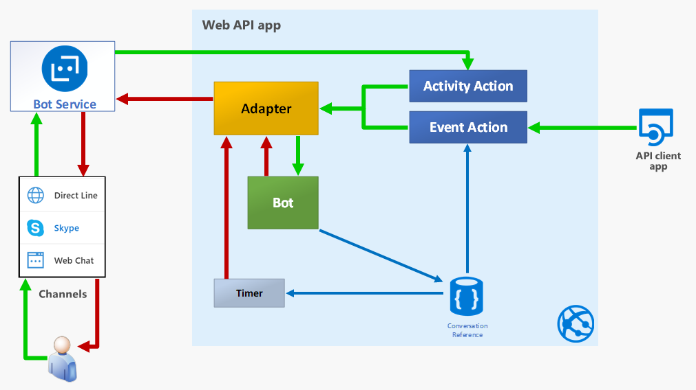
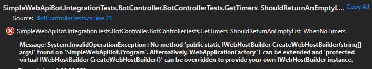
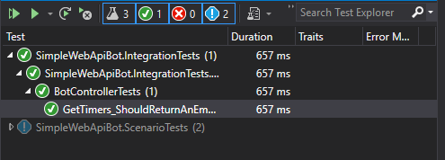

This is the last in a five-post series, where we explore the Bot Framework (previously Bot Builder) SDK v4:

1. [How does a Bot Builder v4 bot work?](/posts/how-does-a-bot-builder-v4-bot-work/)
2. [How to send proactive messages with Bot Builder v4?](/posts/how-to-send-proactive-message-bot-builder-v4)
3. [How to receive events in a Bot Framework SDK v4 Web API bot?](/posts/how-to-receive-events-bot-framework-sdk-v4-web-api-bot)
4. [How to test a Bot Framework SDK v4 bot?](/posts/how-to-test-bot-framework-sdk-v4-bot)
5. **How to do integration testing for a Bot Framework SDK v4 event bot?** (This article)

In the [previous article](/posts/how-to-test-bot-framework-sdk-v4-bot) we focused on testing the interaction of our bot but, since we now have an event bot that can send a proactive message when receiving external events, we'd like to have some way to automate the testing of that event part.

This is a quite interesting topic because we use ASP.NET Core Integration testing and Bot Framework testing in the same project, thanks to the fact that we are using a Web API project for driving the bot.

To test the event handling part we have to execute the API actions of our controller, so the obvious choice is to use the testing features included in the ASP.NET Core framework.

So, in this article, we'll focus on Web API integration testing including the regular bot testing, so this will be some sort of **double integration testing**! 😉

## Overview

In this case the setup process will be more elaborate than the tests themselves, but let's consider them as simple samples that can help us open a world of possibilities.

The idea behind integration testing is that we run a light version of our web server, in the context of our tests, that includes the whole request pipeline down to the controller activation and method invocation, but usually, not including authentication and authorization features and some other concerns that could be the scope of end-to-end testing.

Besides testing the API part, we also need to test the bot so we have to replace the `BotFrameworkAdapter` with the `TestAdapter`, so we can check the bot replies directly without using a [Direct Line](https://docs.microsoft.com/azure/bot-service/bot-service-channel-directline) client.

In the previous article we tested our bot using the `TestFlow` class to send messages to the bot and assert its replies. In this article we send messages through the API controller action and then use the `TestAdapter` to get the replies from the bot.

This means we aren't using `TestFlow`, but this also gives us a bit more flexibility and, as you'll see in the code, it's not too difficult to handle the `TestAdapter` directly.

So this setup is not 100% equivalent to the real thing but, for most situations, is close enough, as you can see in the following diagram:

That you can compare to the real thing, represented next.

Most of the work here is based on the official [Integration tests in ASP.NET Core documentation page](https://docs.microsoft.com/aspnet/core/test/integration-tests), although we'll use a little different approach, that will be detailed later on.

## Implementation details

### The first attempt to the BotControllerTests test class

We begin by testing a new simple Web API endpoint, that was just included in `BotController` for getting started with integration testing.

So, following the [official documentation guidance](https://docs.microsoft.com/aspnet/core/test/integration-tests), we begin with this code for the first version of `BotControllerTests`:


public class BotControllerTests : IClassFixture<WebApplicationFactory<Startup>>, IDisposable
{
    private readonly WebApplicationFactory<Startup> _testServer;

    public BotControllerTests(WebApplicationFactory<Startup> testServer)
    {
        _testServer = testServer ?? throw new ArgumentNullException(nameof(testServer));
    }

    [Fact]
    public async Task GetTimers_ShouldReturnAnEmptyList_WhenNoTimers()
    {
        // Arrange -----------------
        var client = _testServer.CreateClient();

        // Act ---------------------
        var response = await client.GetAsync("/simple-bot/api/timers");
        var data = await response.Content.ReadAsStringAsync();

        // Assert ------------------
        response.EnsureSuccessStatusCode();
        data.Should().NotBeNull();
    }
    //...
}


Which is pretty straight forward and requires no further explanation, having read the [Integration tests in ASP.NET Core documentation page](https://docs.microsoft.com/aspnet/core/test/integration-tests), of course.

However, the test fails miserably:

From the message it's pretty clear that the `WebApplicationFactory` is looking for method `CreateWebHostBuilder(string[] args)` and we don't have that in `Program`.

Anyway, as mentioned in the overview, since we have to change our `Startup` class a little, to use `TestAdapter` instead of `BotFrameworkAdapter`, and to make things a bit more interesting, we'll go the route of extending `WebApplicationFactory<TEntryPoint>`.

So, we create the following class.

### The WebApiBotApplicationFactory


public class WebApiBotApplicationFactory<TEntryPoint> : WebApplicationFactory<TEntryPoint>
    where TEntryPoint : class
{
    private static readonly string ApplicationContext = typeof(Program).Namespace;

    public WebApiBotApplicationFactory()
    {
        Configuration = GetConfiguration();

        ConfigureLogging(Configuration);
    }

    public IConfiguration Configuration { get; }

    protected override IWebHostBuilder CreateWebHostBuilder()
    {
        return WebHost.CreateDefaultBuilder(new string[0])
            .UseStartup<TEntryPoint>()
            .UseConfiguration(Configuration)
            .UseSerilog();
    }

    private static void ConfigureLogging(IConfiguration configuration)
    {
        //...
    }

    private static IConfiguration GetConfiguration() =>
        //...
}


As you can see, the above code is virtually identical to what we have in `Program` and also what we have in `TestingHost`, from the [previous article](/posts/how-to-test-bot-framework-sdk-v4-bot/#the-testinghost-creates-the-tests-context).

So we instantiate and inject `WebApiBotApplicationFactory` in the test class, just as we did with `TestingHost`, as shown in the following code:


public class BotControllerTests : IClassFixture<WebApiBotApplicationFactory<IntegrationTestsStartup>>, IDisposable
{
    private readonly WebApplicationFactory<IntegrationTestsStartup> _testServerFactory;

    public BotControllerTests(WebApiBotApplicationFactory<IntegrationTestsStartup> testServerFactory)
    {
        _testServerFactory = testServerFactory ?? throw new ArgumentNullException(nameof(testServerFactory));
    }

    //...
}


To make things as clear as possible, let me emphasize that the role of `WebApiBotApplicationFactory` is the same as that of `Program` in our Web API project, which is, starting the server, but in the test context.

And this takes us to the next key component, which is the `IntegrationTestsStartup` class, shown just below.

### The IntegrationTestsStartup class

Just as the `Startup` class, this is the class that configures the app before running, as shown next.


public class IntegrationTestsStartup
{
    public IntegrationTestsStartup(IConfiguration configuration)
    {
        Configuration = configuration;
    }

    public IConfiguration Configuration { get; }

    // This method gets called by the runtime. Use this method to configure the HTTP request pipeline.
    public void Configure(IApplicationBuilder app, IHostingEnvironment env)
    {
        app.UseMiddleware<SerilogMiddleware>();

        if (env.IsDevelopment())
        {
            app.UseDeveloperExceptionPage();
        }

        app.UseMvc();
        app.UseBotFramework();
    }

    // This method gets called by the runtime. Use this method to add services to the container.
    public void ConfigureServices(IServiceCollection services)
    {
        services.AddMvc().SetCompatibilityVersion(CompatibilityVersion.Version_2_2);

        services.AddSingleton<IAdapterIntegration, TestAdapterIntegration>();

        services.AddSingleton<TestAdapter>(sp =>
        {
            var logger = sp.GetRequiredService<ILogger<TestAdapter>>();
            var adapter = new TestAdapter();

            adapter.OnTurnError = async (context, exception) =>
            {
                logger.LogError(exception, "----- BOT ERROR - Activity: {@Activity}", context.Activity);
                await context.SendActivityAsync($"ERROR: {exception.Message}");
            };

            return adapter;
        });

        services.AddSingleton<Timers>();
        services.AddSingleton<Conversations>();

        services.AddTransient<IBot, ProactiveBot>();
    }
}


In the above code:

- We configure `TestAdapterIntegration` (a simple wrapper around `TestAdapter`) as the implementation of `IAdapterIntegration` (**line 29**).

- Register and configure `TestAdapter` (**line 31**) because `TestAdapterIntegration` uses it. This is how we configure DI to use the `TestAdapter`, as we mentioned in the [Overview](#overview).

- The rest is pretty much the same as the `ConfigureServices()` in `Startup`.

- This class hast to be in the Web API project, instead of the test project, for two reasons:
  - We are using the Web API project with a slightly different configuration for testing and
  - `WebApplicationFactory` uses the startup class location to setup the `ContentRoot` for the Web API project.

With the above changes we can now run the tests and verify that the base testing infrastructure is working properly:

### The test class

We'll now delve into the details for testing the really interesting functions. The test class is pretty similar to the one shown in the [previous article](/posts/how-to-test-bot-framework-sdk-v4-bot/#using-testinghost-in-test-classes)

We'll look at the tests class from two points of view:

1. The **core test support methods**, this is like the testing "infrastructure" and
2. The **bot test support methods**, to get a similar API to the one from `TestFlow`, to get a similar testing developer experience.

### The core test support methods

This is pretty similar to ones we used in the [previous article](/posts/how-to-test-bot-framework-sdk-v4-bot/#using-testinghost-in-test-classes), as shown in the next code:


public class BotControllerTests : IClassFixture<WebApiBotApplicationFactory<IntegrationTestsStartup>>, IDisposable
{
    private readonly WebApplicationFactory<IntegrationTestsStartup> _testServerFactory;
    private readonly HttpClient _client;
    private readonly IServiceScope _scope;

    public BotControllerTests(WebApiBotApplicationFactory<IntegrationTestsStartup> testServerFactory)
    {
        _testServerFactory = testServerFactory ?? throw new ArgumentNullException(nameof(testServerFactory));
        _client = _testServerFactory.CreateClient();
        _scope = _testServerFactory.Server.Host.Services.CreateScope();
    }

    //...

    private T GetService<T>()
    {
        return _scope.ServiceProvider.GetRequiredService<T>();
    }

    //...

    private bool disposedValue = false; // To detect redundant calls

    protected virtual void Dispose(bool disposing)
    {
        if (!disposedValue)
        {
            if (disposing)
            {
                _scope.Dispose();
            }

            // TODO: free unmanaged resources (unmanaged objects) and override a finalizer below.
            // TODO: set large fields to null.

            disposedValue = true;
        }
    }
}


In the above code:

- We instantiate the `HttpClient` for sending the requests to our Web API application (**line 10**).

- Create a DI scope for the test, to avoid using the root scope (**line 11**).

- Create the **GetService()** method to get instances from the scope (**line 16**)

- We also have to dispose the `_scope` the we created in the constructor (**line 31**), we don't have to dispose `_testServer` because its life cycle (disposing included) is controlled by xUnit's test runner.

### Bot test support methods

In the previous article we used the `TestFlow` class, which is sort of a mock channel, to handle the bot interaction, but since the interaction is not conversation-oriented we are interacting directly with the `TestAdapter`.

To make testing easier, we create a couple of support methods that are similar to the ones provided by `TestFlow`, as shown next:

- **SendAsync** - To send activity messages to the bot.
- **AssertReplyAsync** - To assert the reply from the bot.

#### The SendAsync method

This is basically an API client to post the text message as an BotFramework activity to the endpoint:


private async Task SendAsync(string endpoint, string text)
{
    var botAdapter = GetService<TestAdapter>();
    var activity = botAdapter.MakeActivity(text);
    var activityJson = JsonConvert.SerializeObject(activity);
    var response = await _client.PostAsync(endpoint, new StringContent(activityJson, Encoding.UTF8, "application/json"));

    response.EnsureSuccessStatusCode();
}


In the above code:

- We use the `BotAdapter.MakeActivity()` method to create the activity object (**line 4**) and then

- Post the serialized activity to the endpoint (**Line 6**). This endpoint will be the event callback endpoint in our Web API.

#### The AssertReplyAsync method

For this method we'll implement two overloads, to get a similar  developer experience as with `TestFlow`, as shown next:


private Task AssertReplyAsync(string text, int timeout = 3000)
{
    return AssertReplyAsync(activity => activity.AsMessageActivity().Text.Should().Be(text), timeout);
}

private async Task AssertReplyAsync(Action<IActivity> validateActivity, int timeout = 3000)
{
    var botAdapter = GetService<TestAdapter>();
    var sw = new Stopwatch();

    sw.Start();

    while (sw.ElapsedMilliseconds < timeout)
    {
        var reply = botAdapter.GetNextReply();

        if (reply != null)
        {
            validateActivity.Invoke(reply);

            return;
        }

        await Task.Delay(10);
    }

    throw new TimeoutException($"{timeout}ms Timed out waiting for activity");
}


In the above code:

- Poll the adapter for the next reply (**line 15**) while in the timeout (**line 13**), with a tolerance of 10 ms (**line 24**).

- Validate the reply using the received `validateActivity` action (**line 19**).

### Event Bot tests

At this point we've finally gotten to the real tests that, with all the above preparation, become really simple as shown next.

#### The bot should echo back test

This is a very simple test, mostly for testing our bot testing support methods:


[Theory]
[InlineData(1, "/simple-bot/messages")]
[InlineData(2, "/api/messages")]
public async Task BotShouldEchoBack(int test, string endpoint)
{
    // Arrange -----------------

    // Act ---------------------
    await SendAsync(endpoint, "HI");

    // Assert ------------------
    await AssertReplyAsync("You (\"**User1**\") typed \"HI\"");
}


In the above code:

- We can test both endpoints (**lines 9, 2, and 3**), because we also enabled the Bot Framework with the `app.UseBotFramework()` line in the `Configure()` method from the [IntegrationTestsStartup](#the-integrationtestsstartup-class) class.

#### The bot should create a timer and send a proactive message test

This is a test for the same scenario we implemented and [tested with the emulator in the second article of the series](/posts/how-to-send-proactive-message-bot-builder-v4/#testing-with-the-emulator), only we can now use automated testing.


[Theory]
[InlineData(1, "/simple-bot/messages")]
public async Task BotShouldCreateTimerAndSendProactiveMessage(int test, string endpoint)
{
    // Arrange -----------------
    var timers = GetService<Timers>();
    var conversations = GetService<Conversations>();

    // Act ---------------------
    await SendAsync(endpoint, "TIMER 2");
    await AssertReplyAsync("Starting a 2s timer");

    await SendAsync(endpoint, "TIMER 3");
    await AssertReplyAsync("Starting a 3s timer");

    await AssertReplyAsync(activity => activity.AsMessageActivity().Text
        .Should().StartWith("Timer #1 finished! (2"), 2100);

    await AssertReplyAsync(activity => activity.AsMessageActivity().Text
        .Should().StartWith("Timer #2 finished! (3"), 3100);

    // Assert ------------------
    timers.List.Count.Should().Be(2);

    timers.List.Should().BeEquivalentTo(new[] 
    {
        new { Number = 1, Seconds = 2 }, new { Number = 2, Seconds = 3 }
    });

    timers.List[0].Elapsed.Should().BeApproximately(2000, 20);
    timers.List[1].Elapsed.Should().BeApproximately(3000, 20);

    conversations.Keys.Should().BeEquivalentTo(new[] { "User1" });
}


At this point, the above code shouldn't need further explanation, however, there's some interesting issue here that's left as homework to investigate, to understand a key concept of testing with `IClassFixture<>` feature from xUnit.

- Why can't we test both endpoints (**line 2**) here, the way we did in the previous test? \
\
  We can change line 2 to the `/api/messages` endpoint and it'll work just fine but we can't have both `InlineData()` lines. **Why is it so and how can you fix it?**

#### The bot should send a message when an event is received test

So we finally get to the last test, that combines all of the above:


[Fact]
public async Task BotShouldSendMessage_WhenEventReceived()
{
    // Arrange -----------------
    var eventsEndpoint = "/simple-bot/events";
    var eventName = "testing-event";
    var eventUser = "User1";
    var eventPayload = "Event payload";
    var eventContent = new StringContent(eventPayload, Encoding.UTF8, "application/json");

    // Act ---------------------
    await SendAsync("/simple-bot/messages", "HI");
    await AssertReplyAsync("You (\"**User1**\") typed \"HI\"");

    var response = await _client.PostAsync($"{eventsEndpoint}/{eventName}/{eventUser}", eventContent);

    await AssertReplyAsync($"**{eventName}** event detected - Payload: {eventPayload}");

    // Assert ------------------
    response.EnsureSuccessStatusCode();
}


In the above code:

- We begin by sending a simple message (**line 12**), so we have a conversation reference that we'll use to send an event message to the user, [as explained in the overview of the third article in the series](/posts/how-to-receive-events-bot-framework-sdk-v4-web-api-bot/#overview).

- We can now send an event to the user by posting an event payload to the events endpoint in our controller (**line 15**).

- Finally we just check the bot's notification about the received event (**line 17**)

## Takeaways

To summarize, in this post we've learned:

- How to use the integration testing features from ASP.NET Core.
- How to mix and match bot testing with Web API integration testing.

I Hope you've found this post interesting and useful, and invite you to [follow me on Twitter](https://www.twitter.com/mvelosop) for more posts and news.

You are also welcomed to leave a comment or ask a question [in the comments section below](#disqus_thread).

**Happy coding!**

> **Resources**
>
> - Code repository in GitHub\
>   <https://github.com/mvelosop/GAB2019-BotInternals>
>
> - Bot Framework Direct Line client \
>   <https://docs.microsoft.com/azure/bot-service/bot-service-channel-directline>
>
> - Integration tests in ASP.NET Core documentation page \
>   <https://docs.microsoft.com/aspnet/core/test/integration-tests>
