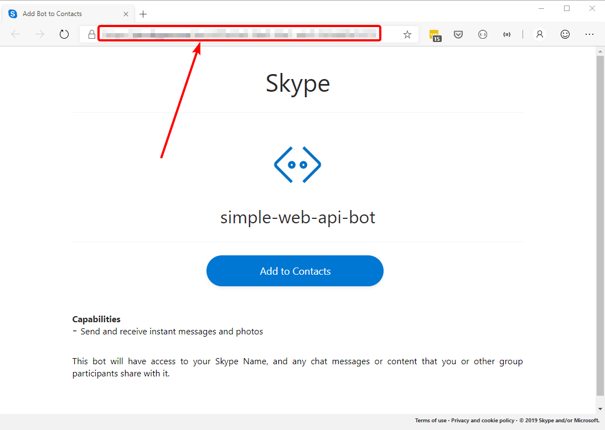

This is the third in a five-post series, where we explore the Bot Builder C# SDK v4:

1. [How does a Bot Builder v4 bot work?](/posts/how-does-a-bot-builder-v4-bot-work/)
2. [How to send proactive messages with Bot Builder v4?](/posts/how-to-send-proactive-message-bot-builder-v4)
3. **How to receive events in a Bot Framework SDK v4 Web API bot?** (This article)
4. How to test a Bot Framework SDK v4 bot?
5. How to build a Bot Framework SDK v4 bot as an Azure Function web API app?

In this article we continue evolving our simple web API bot, so it can receive events from an external system and notify the user that something has happened.

This "something has happened" can be just any event, from an email received to the approval of a payment transaction, as long as we can receive some kind of message in and endpoint.

We'll add an endpoint in out BotController, so it can receive an arbitrary event directed to any user that's been interacting with the bot. We'll use the request body to convey any required event payload.

We'll also add the necessary bits to deploy the bot to an Azure Bot Service Channel so you can use your bot with the Skype application on your mobile phone.

We'll now talk about the "Bot Framework SDK", but that's just the new name for the previous Bot Builder. For this article we are using version 4.3.2 for the Bot Framework SDK.

In this article we use ASP.NET Core's [Development Secrets Manager][1] (a.k.a. User Secrets) for handling the bot's secrets, so you won't find (or use) them in the typical .bot file.

**WARNING:** The code shown here is experimental and has not been tested in production, so handle with care!



## Overview

You might want to read the [overview section of the previous post](/posts/how-to-send-proactive-message-bot-builder-v4#overview), as we're building on it.


To receive events from an external application we'll keep track of conversations with users, so we'll be able to send them arbitrary events using a REST API endpoint. The message will of course go through the `BotFrameworkAdapter`, and since it'll be going to the Azure Bot Service, you'll be able to test it using Skype, with any user you invite to join to your bot, as well as the Bot Channel test web chat, and even the Bot Emulator running locally.

The conversations are used to keep the `ConversationReference` that's needed to send the event message.

To create the REST API endpoint, we'll add a simple action to our existing `BotController`, to showcase the processing of the custom event, which will have a interesting twist.

The code is quite similar to the previous article, and the main changes are:

- Store the conversation reference for every user interaction, so we can send event messages.
- Add a new controller action to receive event messages.
- Handle the CONVERSATIONS command, to display the current ongoing conversations.
- Display event messages for the user in the bot.

We also display some information on the bot's state it's home page, but we'll not include code details here, as you can check [the repo in GitHub][2].

## Implementation details

### The bot

We add a few lines of code to the bot, but we'll focus on the most important ones:


public async Task OnTurnAsync(ITurnContext turnContext, CancellationToken cancellationToken = default)
{
    var activityType = turnContext.Activity.Type;
    var conversationReference = (ConversationReference)null;

    if (activityType == ActivityTypes.Message || activityType == ActivityTypes.ConversationUpdate)
    {
        conversationReference = turnContext.Activity.GetConversationReference();

        _logger.LogTrace("----- ProactiveBot - Get conversation reference - Activity type: {ActivityType} User: \"{User}\" - ConversationReference: {@ConversationReference}", activityType,  conversationReference.User.Name, conversationReference);

        if (conversationReference.User.Name != null)
        {
            _conversations.Save(conversationReference);
        }
    }

    if (activityType == ActivityTypes.Message)
    {
        var text = turnContext.Activity.Text.Trim();

        _logger.LogInformation("----- Receiving message activity - Text: {Text}", text);

        var username = conversationReference.User.Name;

        //...
        else if (text.StartsWith("conversations", StringComparison.InvariantCultureIgnoreCase))
        {
            var conversations = string.Join("\n", _conversations.Select(c => $"- **{c.Key}**: {c.Value.ChannelId} ({c.Value.User.Id})"));

            await turnContext.SendActivityAsync($"**CONVERSATIONS**\n{conversations}");
        }
        //...
    }
    else if (activityType == ActivityTypes.Event)
    {
        var name = turnContext.Activity.Name;
        var value = turnContext.Activity.Value;

        _logger.LogInformation("----- Receiving event activity - Name: {Name} ({Value})", name, value);

        await turnContext.SendActivityAsync($"**{name}** event detected - Payload:  {value}");
    }
    else
    {
        await turnContext.SendActivityAsync($"**{turnContext.Activity.Type}** activity received");
    }
}


In the code above:

- Save/update the conversation reference (**line 14**) when we have the user name, for **Message** and **ConversationUpdate** activities (there's no user for the channel ConversationUpdate activity).

- Handle the CONVERSATIONS "command" (**line 27**).

- Handle **Event type** activities (**Line 35**) to display event data.

### The conversation store

The conversation store (`Conversations`) is a pretty simple extension of a `ConcurrentDictionary<string, ConversationReference>`, that doesn't need further comment, as shown here:


public class Conversations : ConcurrentDictionary<string, ConversationReference>
{
    public ConversationReference Get(string userName)
    {
        if (TryGetValue(userName, out ConversationReference value))
        {
            return value;
        }

        return null;
    }

    public void Save(ConversationReference conversationReference)
    {
        AddOrUpdate(
            conversationReference.User.Name,
            conversationReference,
            (key, oldValue) => conversationReference);
    }
}


### The Controller

Let's begin with the initial controller action that receives messages from the Bot Service and sends messages back to the user. Since we are dealing with "the real thing" authorization is a must, and it's easily handled like this:


[HttpPost("/simple-bot/messages")]
public async Task<InvokeResponse> Messages([FromBody]Activity activity)
{
    _logger.LogTrace("----- BotController - Receiving message activity: {@Activity}", activity);

    var authHeader = HttpContext.Request.Headers["Authorization"];

    return await _adapter.ProcessActivityAsync(authHeader, activity, _bot.OnTurnAsync, default);
}


- We can just use the same authorization header from the incoming message to send messages back to the channel (**line 6**).

    This wasn't needed when using the Bot Emulator, so we just used to send an empty header.

For the event receiving endpoint we implement the following action, explained below as usual:


[HttpPost("/simple-bot/events/{eventName}/{userName}")]
public async Task<InvokeResponse> Events([FromRoute]string eventName, [FromRoute]string userName)
{
    string body = null;

    userName = WebUtility.UrlDecode(userName);

    using (var reader = new StreamReader(ControllerContext.HttpContext.Request.Body))
    {
        // quick and dirty sanitization
        body = (await reader.ReadToEndAsync())
            .Replace("script", "", StringComparison.InvariantCultureIgnoreCase)
            .Replace("href", "", StringComparison.InvariantCultureIgnoreCase);
    }

    _logger.LogTrace("----- BotController - Receiving event: \"{EventName}\" - user: \"{UserName}\" ({Body})", eventName, userName, body);

    var conversation = _conversations.Get(userName);

    if (conversation == null)
    {
        return new InvokeResponse { Status = 404, Body = body };
    }

    var botAppId = _configuration["BotWebApiApp:AppId"];

    await _adapter.ContinueConversationAsync(botAppId, conversation, async (context, token) =>
    {
        context.Activity.Name = eventName;
        context.Activity.RelatesTo = null;
        context.Activity.Value = body;

        _logger.LogTrace("----- BotController - Craft event activity: {@Activity}", context.Activity);

        await _bot.OnTurnAsync(context, token);
    });

    return new InvokeResponse { Status = 200, Body = body };
}


In the code above:

- We can define our endpoint in any way that suit us, in this case we'll receive the `eventName` and the target `userName` as part of the path and the request body will contain the event payload, which can be a simple text message or a Json object (**line 1**).

- A conventional StreamReader (**line 8**) reads the body into a string, with a really simple sanitization (**line 11**).

- We get the conversation reference from the conversation store, searching by user name (**line 18**).

- We take the bot `ApplicationId` from configuration (**line 25**).

- Using a trick commented by [@SarangRapid on GitHub][3], we call the `ContinueConversationAsync` from `IAdapterIntegration` (**line 27**), tweaking the activity a bit to add our event information (**lines 29-31**), before calling the bot's `OnTurnAsync` (**line 35**).

### The timer class

The only relevant change for the timer class is to include the bot `ApplicationId` as a constructor parameter, since it's required to send proactive messages through the Bot Service. The change is shown in the following code:


public class Timer
{
    //...
    public Timer(
        IAdapterIntegration adapter,
        string botAppId,
        ConversationReference conversationReference,
        int seconds,
        int number)
    {
        //...
        _botAppId = botAppId;
        //...
    }

    //...

    public async Task Start()
    {
        //...
        await _adapter.ContinueConversationAsync(_botAppId, ConversationReference, SendMessageAsync);
    }
    //...
}


### Bot setup

We also need to add some code to `Startup.cs`, as shown below:


public class Startup
{
    //...

    // This method gets called by the runtime. Use this method to configure the HTTP request pipeline.
    public void Configure(IApplicationBuilder app, IHostingEnvironment env)
    {
        app.UseMiddleware<SerilogMiddleware>();

        if (env.IsDevelopment())
        {
            app.UseDeveloperExceptionPage();
        }

        app.UseMvc();
        app.UseBotFramework();
    }

    // This method gets called by the runtime. Use this method to add services to the container.
    public void ConfigureServices(IServiceCollection services)
    {
        services.AddMvc().SetCompatibilityVersion(CompatibilityVersion.Version_2_2);

        services.AddSingleton<IAdapterIntegration>(sp => 
        {
            var logger = sp.GetRequiredService<ILogger<IAdapterIntegration>>();
            var appId = Configuration["BotWebApiApp:AppId"];
            var appPassword = Configuration["BotWebApiApp:AppPassword"];

            var adapter = new BotFrameworkAdapter(
                credentialProvider: new SimpleCredentialProvider(appId, appPassword),
                logger: logger);

            //...

            return adapter;
        });

        services.AddSingleton<Timers>();
        services.AddSingleton<Conversations>();

        services.AddTransient<IBot, ProactiveBot>();
    }
}


In the code above:

- We add a [Serilog middleware][4] to the request pipeline (**line 8**), to log additional information from all incoming requests.

- We also add the Bot Framework to the request pipeline (**line 16**), only to show that you can also handle bot messages in the `/api/messages` endpoint in addition to our own `/simple-bot/messages` (You'll also have to update the Bot Channel settings in Azure).

    You can also try changing the endpoint in the controller to `/api/messages` and explore in the logs what happens when you change the relative order between `app.UseMvc()` and `app.UseBotFramework()` and even commenting them out! (that's a homework assignment 😉).

- Get the `ApplicationId` and `ApplicationPassword` from configuration (**lines 27-28**) to use them with the `SimpleCredentialProvider` (**line 31**). More on this in the [Deployment](#deployment) section.

- Finally the `Conversations` class is registered as a singleton (**line 40**), for in-memory storage only.

### Bot Home page

The bot home page was also updated to display internal information about the bot. We won't get into the details, as you can see them in the `Pages/Index.cshtml` Razor Page in the repo. The new home page should look something like this:


In the above image:

- You can see the local endpoints of your bot (**#1**), but you'll also be able to use the public endpoints we'll publish through [ngrok][5] (more on this in the next section).

- You can see the channel where the conversation is happening (**#2**). Usernames are "hard coded" in the web chat and emulator.

- You can use the sample [curl][6] (**#3**) commands to send events to your bot. You can also use [Postman][7] for this.

## Deployment

If you want to use Skype or other supported channel, you have to create a Bot Channel registration in Azure and make the bot's endpoint publicly available.

In this article we'll create a temporary public address with [ngrok][5] that will redirect all incoming requests to our Web API app running locally. Then we'll use that public address to configure the Bot Channel registration.

After that, it should be pretty easy to completely deploy the web API app to Azure and have your bot running completely in the cloud. Just remember we're using in-memory storage here, so everything will reset when the app restarts.

This is the deployment overview:

- Create an ngrok temporary public address.
- Initialize User Secrets in Visual Studio to store the application secrets for deploying to Azure.
- Configure the Azure Bot Channel Registration.
- Run your web API app locally
- Add Skype to your Bot Channel Registration.

### ngrok setup

You have to [install ngrok][8] in you computer and then run the batch file `start-ngrok.cmd` located in the **ngrok** folder in the **SimpleWebApiBot** project.

After starting ngrok you should see the program running from the command line like this:


And a web browser page like this one:


Copy the **forwarding/tunnel URL** you get (similar to the one highlighted in the images above), you'll use it later to configure the Bot Channel Registration.

### Initialize user secrets in Visual Studio

Click the **Manage user secrets** option on project's context menu:


And initialize the newly created file with this parameters:

```json
{
  "BotWebApiApp:AppId": "<Application-ID>",
  "BotWebApiApp:AppPassword": "<Application-Password>"
}
```

The above values will replace the parameters in `appsettings.json`:

```json
{
  "BotWebApiApp": {
    "AppId": "",
    "AppPassword": ""
  }
}
```

For further information on managing user secrets see here: https://docs.microsoft.com/aspnet/core/security/app-secrets

### Azure setup

You'll need an Azure subscription to complete this section and [you can get a free one here][9] in case you don't have one yet.

To complete the Azure setup you'll need to:

1. Create a Bot Channel Registration

2. Create an `ApplicationId` and `ApplicationPassword` for your bot application (The web API app).

3. Configure the `ApplicationId` and `ApplicationPassword` in your web API app

#### Create a Bot Channel Registration


In the above view you have to configure the following parameters:

1. Name of your bot (the name shown is already taken!)
2. Subscription
3. Resource group
4. Location
5. Pricing tier (choose F0 - Free 10K messages/month)
6. Messaging endpoint (use the **tunnel URL** from the ngrok setup to configure, something similar to `https://11c4be46.ngrok.io/simple-bot/messages`)
7. Click on "Auto create App ID and password

#### Create an application ID and password for your bot

On the new blade click on "Create App ID in the App Registration Portal":


You should get to a page like this in the Application Registration Portal (you might need to login):


Copy the highlighted field to replace the `<Application-ID>` value in the user secrets file.

Then click on the **Generate an app password to continue** button to get this pop-up:


Copy the Application Password to replace the `<Application-Password>` value in the user secrets file.

Close the Applications Portal and return to the Bot Channel Registration in the Azure portal, to register el App ID and password in the proper fields:


Then:

1. Click the **OK button** on the Create new Microsoft Application blade.
2. Click the **Create button** on the Bot Channels Registration blade.

#### Run the bot application locally

Now just run the **SimpleWebApiBot** app from Visual Studio with [Ctrl+F5] or [F5]\(for debugging), so the requests forwarded from ngrok are handled by your bot application.

#### Test the bot with Web Chat

When the creation process finishes you should be ready for testing with the Web Chat:


#### Add Skype channel

To add the Skype channel to your bot, go to the channels page:


Click on the Configure Skype button in the "Add a featured channel" section and wait for few seconds until you get this view:


At this point the Skype channel has already been added, so you can click on the channels option again on the left panel, to see the Skype channel in your bot:


Then, click on the Skype logo to get to this view. From there you can add the bot to your contacts or mail the url to invite anyone to join:



In this point you should be able to use the bot from your mobile phone or your desktop, at least while the **ngrok** redirection is working.

## Takeaways

To summarize, in this post we've learned to:

- Handle any incoming request and convert them to events for your bot.
- Use simple ASP.NET Core style configuration for a bot application.
- Use the Development Secrets Manager to keep app secrets out of the code.
- Use ngrok to expose any local app with a public address.
- Configure a Bot Channel Registration in Azure.

I Hope you've found this post interesting and useful. [Follow me on Twitter](https://www.twitter.com/mvelosop) for more posts.

You are also welcomed to leave a comment or ask a question [in the comments section below](#disqus_thread).

**Happy coding!**

> **Resources**
>
> - Code repository in GitHub \
>   <https://github.com/mvelosop/GAB2019-EventBot>
>
> - Development Secrets Manager \
>   <https://docs.microsoft.com/aspnet/core/security/app-secrets>
>
> - @SarangRapid comment in GitHub \
>   <https://github.com/Microsoft/botbuilder-dotnet/issues/787#issuecomment-486587081>
>
> - Serilog logging middleware blog post \
>   <https://blog.datalust.co/smart-logging-middleware-for-asp-net-core/>
>
> - ngrok \
>   <https://ngrok.com/>
>
> - curl \
>   <https://curl.haxx.se/>
>
> - Azure account free offer \
>   <https://azure.microsoft.com/free/>

[1]:https://docs.microsoft.com/aspnet/core/security/app-secrets
[2]:https://github.com/mvelosop/GAB2019-EventBot
[3]:https://github.com/Microsoft/botbuilder-dotnet/issues/787#issuecomment-486587081
[4]:https://blog.datalust.co/smart-logging-middleware-for-asp-net-core/
[5]:https://ngrok.com/
[6]:https://curl.haxx.se/
[7]:https://blog.getpostman.com/
[8]:https://ngrok.com/download
[9]:https://azure.microsoft.com/free/
