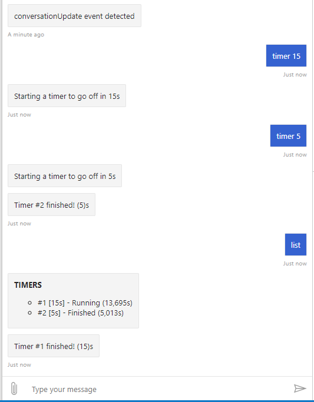
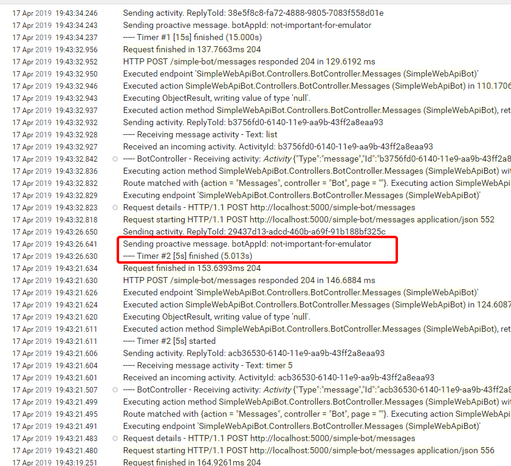

In this post we'll continue with the bot we completed in [the previous post](/posts/how-does-a-bot-builder-v4-bot-work/) to add the ability to send proactive messages.

A proactive message is just one that's sent without the user typing anything, so it's not a reply to user input.

In the previous post we realized that the `BotFrameworkAdapter` is responsible to send a message to the Bot Service/Emulator, so it's received by the user.

We'll add a new feature so our bot can set a timer and then notify the user when it goes off.

**WARNING:** Consider this post as experimental and not production safe!



## Overview

To implement this feature, we have a `Timer` class with a `Start` method that waits asynchronously for the configured time and then directly calls the `ContinueConversationAsync` method in the adapter, to send the message back to the emulator.

To use the `ContinueConversationAsync` method we need a reference to the adapter and a `ConversationReference`, that identifies the conversation that will receive the proactive message, so we need to have both in the timer.

When the user sends a **TIMER \<seconds\>** message, a new instance of `Timer` is created, and then started in a separate thread, so it runs independently until if finishes. When the time's up the `Timer` sends a message back to the user.

All timer instances are "managed" in class `Timers`, registered as a singleton, that keeps the collection of timers and has a `List` property that's used to report on the timer list, when the user sends a **TIMERS** message.

## Implementation details

### The Controller

In this case we add a few lines to the `BotController` to handle the new feature as shown here:


[ApiController]
public class BotController : ControllerBase
{
    private readonly ILogger<BotController> _logger;
    private readonly IAdapterIntegration _adapter;
    private readonly Timers _timers;

    public BotController(
        ILogger<BotController> logger,
        IAdapterIntegration adapter,
        Timers timers)
    {
        _logger = logger ?? throw new ArgumentNullException(nameof(logger));
        _adapter = adapter ?? throw new ArgumentNullException(nameof(adapter));
        _timers = timers ?? throw new ArgumentNullException(nameof(timers));
    }

    [HttpPost("/simple-bot/messages")]
    public async Task<InvokeResponse> Messages([FromBody]Activity activity)
    {
        _logger.LogTrace("----- BotController - Receiving activity: {@Activity}", activity);

        return await _adapter.ProcessActivityAsync(string.Empty, activity, OnTurnAsync, default);
    }

    private async Task OnTurnAsync(ITurnContext turnContext, CancellationToken cancellationToken)
    {
        if (turnContext.Activity.Type == ActivityTypes.Message)
        {
            var text = turnContext.Activity.Text.Trim();

            _logger.LogInformation("----- Receiving message activity - Text: {Text}", text);

            if (text.StartsWith("timer ", StringComparison.InvariantCultureIgnoreCase))
            {
                var seconds = Convert.ToInt32(text.Substring(text.IndexOf(" ")));

                await turnContext.SendActivityAsync($"Starting a {seconds}s timer");

                _timers.AddTimer(turnContext.Activity.GetConversationReference(), seconds);
            }
            else if (text.StartsWith("timers", StringComparison.InvariantCultureIgnoreCase))
            {
                var alarms = string.Join("\n", _timers.List.Select(a => $"- #{a.Number} [{a.Seconds}s] - {a.Status} ({a.Elapsed / 1000:n3}s)"));

                await turnContext.SendActivityAsync($"**TIMERS**\n{alarms}");
            }
            else
            {
                // Echo back to the user whatever they typed.
                await turnContext.SendActivityAsync($"You typed \"{text}\"");
            }
        }
        else
        {
            await turnContext.SendActivityAsync($"{turnContext.Activity.Type} event detected");
        }
    }
}


In detail: 

- The timer collection class is constructor-injected into the class (**line 11**).

- When the user sends a **TIMER <seconds>** message (**line 34**) we do a simple parsing and create a timer, getting the conversation reference (**line 40**) while in the conversation context.

- Getting the conversation reference is the key to send proactive messages.

- The **TIMERS** command is handled in **line 42**.

### The Timer collection

The `TimerCollection` "manages" the timers through the `AddTimer` method and keeps track of them, as shown here:


public class Timers
{
    private readonly IAdapterIntegration _adapter;

    public Timers(IAdapterIntegration adapter)
    {
        _adapter = adapter;
    }

    public List<Timer> List { get; set; } = new List<Timer>();

    public void AddTimer(ConversationReference reference, int seconds)
    {
        var timer = new Timer(_adapter, reference, seconds, List.Count + 1);

        Task.Run(() => timer.Start());

        List.Add(timer);
    }
}


This class:

- Gets the adapter injected (**line 5**).

- Creates the timer with a reference to the adapter and the conversation (**line 14**), so it can send the message through the adapter.

- Starts the timer in a separate thread, to run until finished independently (**line 16**).

### The Timer class

Finally, the `Timer` class is pretty straight forward:
  
 
public class Timer
{
    private readonly IAdapterIntegration _adapter;
    private readonly ILogger _logger;

    public Timer(
        IAdapterIntegration adapter,
        ConversationReference conversationReference,
        int seconds,
        int number)
    {
        _adapter = adapter;
        _logger = Log.ForContext<Timer>();

        ConversationReference = conversationReference;
        Seconds = seconds;
        Number = number;
    }

    public ConversationReference ConversationReference { get; }
    public double Elapsed => ((FinishedAt ?? DateTime.Now) - (StartedAt ?? DateTime.Now)).TotalMilliseconds;
    public DateTime? FinishedAt { get; private set; }
    public int Number { get; }
    public int Seconds { get; }
    public DateTime? StartedAt { get; private set; }
    public string Status { get; private set; } = "Started";

    public async Task Start()
    {
        _logger.Information("----- Timer #{Number} [{Duration}s] started", Number);

        StartedAt = DateTime.Now;
        Status = "Running";

        await Task.Delay(Seconds * 1000);

        FinishedAt = DateTime.Now;
        Status = "Finished";

        _logger.Information("----- Timer #{Number} [{Duration}s] finished ({Elapsed:n3}s)", Number, Seconds, Elapsed / 1000);

        await _adapter.ContinueConversationAsync("not-important-for-emulator", ConversationReference, SendMessageAsync);
    }

    private async Task SendMessageAsync(ITurnContext turnContext, CancellationToken cancellationToken)
    {
        await turnContext.SendActivityAsync($"Timer #{Number} finished! ({Seconds})s");
    }
}


Details explained here:

- The timer needs a reference to the `BotFrameworkAdapter` (**line 7**) and a the `ConversationReference` (**line 8**), as required by the `ContinueConversationAsync` method from the adapter.

- The timer waits asynchronously (**line 35**).

- And finally calls the `ContinueConversationAsync` adapter method (**line 42**)

- That invokes the `SendMessageAsync` timer method (**line 45**).

### Setting up Startup.cs

The only thing missing is registering the `Timers` class in `ConfigureServices` with:

```cs
services.AddSingleton<Timers>();
```

### Testing with the emulator

So we're now ready to test with the Bot Emulator and we should get something like this:



And we should also get log events similar to these:



## Refactoring

As a finishing touch, we'll now refactor the bot to a class of its own, since the controller is getting way too complex, taking care of matter out of its purpose.

The refactoring is quite straight forward and results in the following classes.

### BotController


[ApiController]
public class BotController : ControllerBase
{
    private readonly ILogger<BotController> _logger;
    private readonly IAdapterIntegration _adapter;
    private readonly IBot _bot;

    public BotController(
        ILogger<BotController> logger,
        IAdapterIntegration adapter,
        IBot bot)
    {
        _logger = logger ?? throw new ArgumentNullException(nameof(logger));
        _adapter = adapter ?? throw new ArgumentNullException(nameof(adapter));
        _bot = bot ?? throw new ArgumentNullException(nameof(bot));
    }

    [HttpPost("/simple-bot/messages")]
    public async Task<InvokeResponse> Messages([FromBody]Activity activity)
    {
        _logger.LogTrace("----- BotController - Receiving activity: {@Activity}", activity);

        return await _adapter.ProcessActivityAsync(string.Empty, activity, _bot.OnTurnAsync, default);
    }


Here we can see that now the bot is injected in **line 11** and its `OrTurnAsync` method called in **line 23**.

### ProactiveBot

This is pretty much the same that was in the controllers, so I think it doesn't need any more explanation


public class ProactiveBot : IBot
{
    private readonly ILogger<ProactiveBot> _logger;
    private readonly Timers _timers;

    public ProactiveBot(
        ILogger<ProactiveBot> logger,
        Timers timers)
    {
        _logger = logger ?? throw new ArgumentNullException(nameof(logger));
        _timers = timers ?? throw new ArgumentNullException(nameof(timers));
    }

    public async Task OnTurnAsync(ITurnContext turnContext, CancellationToken cancellationToken = default)
    {
        if (turnContext.Activity.Type == ActivityTypes.Message)
        {
            var text = turnContext.Activity.Text.Trim();

            _logger.LogInformation("----- Receiving message activity - Text: {Text}", text);

            if (text.StartsWith("timer", StringComparison.InvariantCultureIgnoreCase))
            {
                var seconds = Convert.ToInt32(text.Substring(text.IndexOf(" ")));

                await turnContext.SendActivityAsync($"Starting a timer to go off in {seconds}s");

                _timers.AddTimer(turnContext.Activity.GetConversationReference(), seconds);
            }
            else if (text.StartsWith("list", StringComparison.InvariantCultureIgnoreCase))
            {
                var alarms = string.Join("\n", _timers.List.Select(a => $"- #{a.Number} [{a.Seconds}s] - {a.Status} ({a.Elapsed / 1000:n3}s)"));

                await turnContext.SendActivityAsync($"**TIMERS**\n{alarms}");
            }
            else
            {
                // Echo back to the user whatever they typed.
                await turnContext.SendActivityAsync($"You typed \"{text}\"");
            }
        }
        else
        {
            await turnContext.SendActivityAsync($"{turnContext.Activity.Type} event detected");
        }
    }
}


And for this to work, we just need to register the above class in `ConfigureServices` with:

```cs
services.AddTransient<IBot, ProactiveBot>();
```

## Conclusions

- To send a proactive message we just really need the adapter and the conversation reference, not really the bot instance.

- The above conclusion confirms that the connection to the Bot Service (or the emulator) is independent of a request, as we found out in the previous article.

- This might be the basis for the bot to handle an arbitrary event, and report back to the user about it. We'll explore this in the next article.

We'll see some of this in the next article, so stay tuned and [follow me on Twitter](https://twitter.com/mvelosop).

Hope this helps you.

Happy coding!
