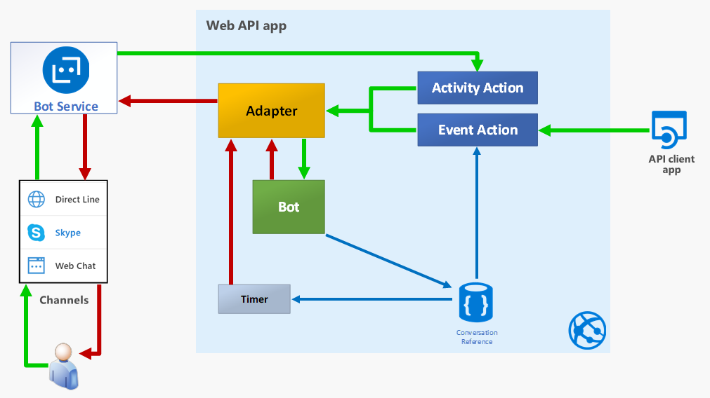
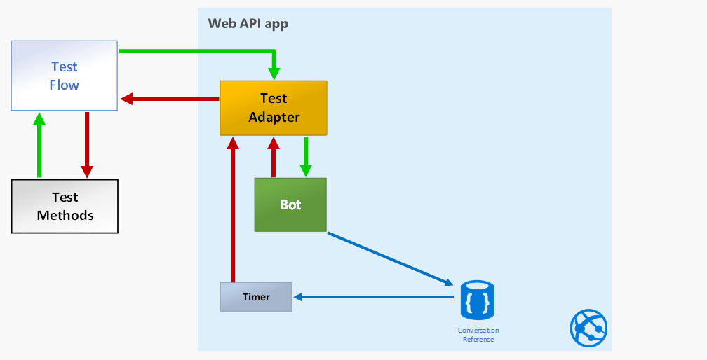
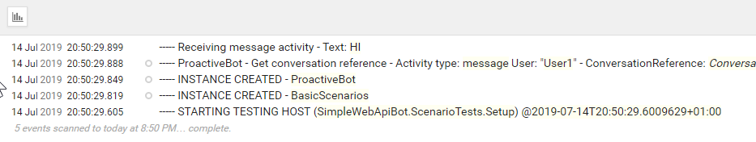
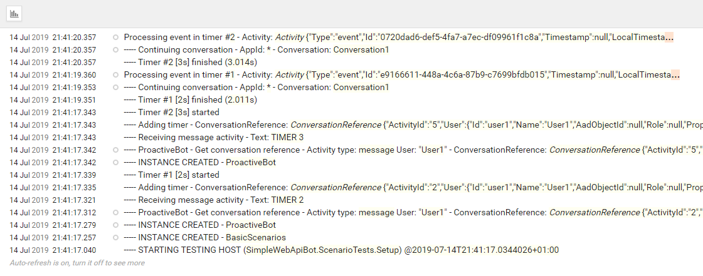

This is the fourth in a six-post series, where we explore the Bot Framework (previously Bot Builder) SDK v4:

1. [How does a Bot Builder v4 bot work?](/posts/how-does-a-bot-builder-v4-bot-work/)
2. [How to send proactive messages with Bot Builder v4?](/posts/how-to-send-proactive-message-bot-builder-v4)
3. [How to receive events in a Bot Framework SDK v4 Web API bot?](/posts/how-to-receive-events-bot-framework-sdk-v4-web-api-bot)
4. **How to test a Bot Framework SDK v4 bot?** (This article)
5. How to do integration testing for a Bot Framework SDK v4 event bot?
6. How to build a Bot Framework SDK v4 bot as an Azure Function web API app?

In this article we'll continue to work on our simple Web API bot, but focusing on the testing side. We won't be adding any new feature but we'll explore some interesting techniques to use DI (Dependency Injection) for testing.

Up to this article this was going to be a five part series, but the testing topic proved to larger than initially thought, so I'm splitting testing in two parts. We'll explore "scenario testing" here, and integration testing in the next article. Scenario testing is kind of high-level unit testing, where we make sure the bot interactions work as expected.

One of the nice additions to Bot Framework v4 are some classes that make it so easy to test your conversation scenarios that there's almost no excuse not to do it.

Just a warning about what you're about to read, I tend to be pragmatic regarding testing, and usually do much more high level integration and scenario testing than unit testing. Anyway, I try to do as little testing as possible, just enough to make me feel safe, following [Kent Beck's guidance](https://stackoverflow.com/questions/153234/how-deep-are-your-unit-tests#answer-153565).

So, the "scenario testing" we'll explore here, is just a thread in the conversation with the bot. This might seem like too much work for testing all of the bot interactions, but we'll see there's a way to reuse the interactions so, in the end, testing bot interactions is hopefully not as hard as it might seem.

**WARNING:** The code shown here is experimental and has not been tested in production, so handle with care!



## Overview

You might want to read the [overview section of the first post in the series](/posts/how-does-a-bot-builder-v4-bot-work#overview), as we're building on it.

By combining the diagrams of all previous posts, we can summarize our event bot with the following diagram.

As we explained there, all interaction with the bot code goes through the Bot Service in Azure, and then through the Bot Adapter, in your application server, that connects your bot code to the Bot Service.

When working with the Bot Service, you use the `BotFrameWorkAdapter`, that inherits from the `BotAdapter` abstract class.

For testing, the Bot Framework team created a `TestAdapter` and a `TestFlow` class. The `TestAdapter` as it name implies is just that, and it also inherits from the `BotAdapter`. The `TestFlow` is just a mock channel, a helper for the test methods, that makes it easy to:

1. Send "user" messages to the bot through the adapter and
2. Assert that the bot replies with the expected message or activity.

So the the scenario testing structure can be represented with the following diagram.

So, with this setup, the test methods interact with the `TestFlow`, that uses the `TestAdapter` to get to the bot code. We don't test anything from the MVC components in this article. We'll leave that kind of integration testing for the next one.

We'll now get into the details of the testing setup, which you might find a bit unusual, from a unit testing point of view, because we configure a DI container, along with all needed services, much like you'd expect in an ASP.NET Core application.

However, this approach will make our test methods very simple, which is pretty good, and will also make it easier to use all services through DI, including logging, that as you might know by now, I tend to lean on a lot.

We use te `TestingHost` to create a testing environment the supports DI for the tests, using the [**IClassFixture\<T\>** interface from xUnit](https://xunit.net/docs/shared-context#class-fixture).

## Implementation details

### Setting up Dependency Injection (DI)

For a long time for me, dependency injection was one of those "magic features" that "just happened" when creating an ASP.NET Core project, but didn't really understand what was going on. Just in case you feel the same, we'll explore how to add DI for testing, to learn that it's a pretty simple feature to implement in any kind of project.

So, we can summarize that, to use DI you just need:

1. A `ServiceCollection` that holds the service registrations and lasts for the life of the application.

2. Whatever services you might need, registered in the `ServiceCollection`.

3. An `IServiceScope` to define the lifetime of requested services that also allows you to get the instances of your services.

#### Base implementation

The simplest way set up  DI in a console application would be like this:


var configuration = new ConfigurationBuilder()
    .SetBasePath(Directory.GetCurrentDirectory())
    .AddJsonFile("appsettings.json", optional: false, reloadOnChange: true)
    .Build();

var services = new ServiceCollection();

services.AddSingleton(configuration);
services.AddScoped<IAdapterIntegration, TestAdapterIntegration>();
services.AddScoped<Timers>();

var rootScope = services.BuildServiceProvider().CreateScope();

using (var scope = rootScope.ServiceProvider.CreateScope())
{
    var timers = scope.ServiceProvider.GetRequiredService<Timers>();

    //...
}


In the above code, we:

- Create a configuration service based on an `appsettings.json` file (**line 1**). Well, to be fair, you don't really need a configuration service to use DI, but it's pretty useful for the application..

- Create the service collection for DI (**line 6**).

- Register the required services (**lines 8-10**).

- Create the root scope for the whole application (**line 12**).

- Create a temporary scope to use the registered services (**line 14**).

- Request the required instances from DI (**line 16**).

The key part here is that whenever you're going to request a service from the DI container, you have to define a scope to dispose all requested services that belong to the scope (and are not singletons). We'll use this later, only with a little twist.

In an ASP.NET Core application, a scope is automatically created (and disposed of) for every request.

#### The TestingHost creates the tests context

To create a testing environment similar to what we get in ASP.NET, we create a `TestingHost` class, that's a combination of the typical `Program` and `Startup` classes, like this:


public class TestingHost : IDisposable
{
    private static readonly string ApplicationContext = typeof(TestingHost).Namespace;

    public TestingHost()
    {
        Configuration = GetConfiguration();

        ConfigureLogging(Configuration);

        Log.Information("----- STARTING TESTING HOST ({ApplicationContext}) @{Date}", ApplicationContext, DateTime.Now);

        var services = new ServiceCollection();

        ConfigureServices(services);

        RootScope = services.BuildServiceProvider().CreateScope();
    }

    public IConfiguration Configuration { get; }

    public IServiceScope RootScope { get; }

    public IServiceScope CreateScope() => RootScope.ServiceProvider.CreateScope();

    private void ConfigureLogging(IConfiguration configuration)
    //...

    private void ConfigureServices(ServiceCollection services)
    //...

    private IConfiguration GetConfiguration() =>
    //...
}


In the above code we:

- Set up a DI container similar to the [Base implementation](#base-implementation) we showed before, in the class constructor (**Line 5**).

- Add a method to create a DI scope (**line 24**) whenever we need it for the test methods.

- Add a `ConfigureServices` method to register services (**line 29**).

#### Configuring services

The following code registers the services we need for testing our bot:


private void ConfigureServices(ServiceCollection services)
{
    // General infrastructure services configuration
    services.AddSingleton(Configuration);
    services.AddSingleton(new LoggerFactory().AddSerilog());
    services.AddLogging();

    // Bot configuration
    services.AddScoped<TestAdapter>(sp =>
    {
        var logger = sp.GetRequiredService<ILogger<TestAdapter>>();
        var adapter = new TestAdapter();

        adapter.OnTurnError = async (context, exception) =>
        {
            logger.LogError(exception, "----- BOT ERROR - Activity: {@Activity}", context.Activity);
            await context.SendActivityAsync($"ERROR: {exception.Message}");
        };

        return adapter;
    });

    services.AddScoped<IAdapterIntegration, TestAdapterIntegration>();

    services.AddScoped<Timers>();
    services.AddScoped<Conversations>();

    services.AddTransient<TestFlow>(sp => new TestFlow(sp.GetService<TestAdapter>(), sp.GetService<IBot>()));
    services.AddTransient<IBot, ProactiveBot>();


In the above code:

- Configure the `TestAdapter`, much like the `BotFrameworkAdapter` in the bot web app (**lines 9-21**).

- Configure an `IAdapterIntegration`, that's needed by our bot to send proactive messages and handle events, implemented by `TestAdapterIntegration` (**line 23**).\
\
  `TestAdapterIntegration` is just a wrapper for `TestAdapter` that implements `IAdapterIntegration`.

- Register the `TestFlow` with a factory (**line 28**), to use the appropriate constructor.

- Finally, register our bot (**line 29**).

#### Using TestingHost in test classes

Now we need to instantiate `TestingHost` so it lasts for the duration of the tests, and for that we use the `IClassFixture<T>` interface from xUnit. 

`IClassFixture<T>` is a marker interface that identifies classes that have to be instantiated by xUnit before running any test. These instances will also disposed of by the test runner, if they implement `IDisposable`, after running all tests.

This is the way use `IClassFixture<T>`:


public class BasicScenarios : IClassFixture<TestingHost>, IDisposable
{
    private readonly IServiceScope _scope;
    private readonly ILogger<BasicScenarios> _logger;

    public BasicScenarios(TestingHost host)
    {
        _scope = (host ?? throw new ArgumentNullException(nameof(host))).CreateScope();
        _logger = GetService<ILogger<BasicScenarios>>();

        _logger.LogTrace("----- INSTANCE CREATED - {ClassName}", GetType().Name);
    }

    // test methods...

    private T GetService<T>() => _scope.ServiceProvider.GetRequiredService<T>();

    #region IDisposable Support
    private bool disposedValue = false; // To detect redundant calls

    protected virtual void Dispose(bool disposing)
    {
        if (!disposedValue)
        {
            if (disposing)
            {
                _scope.Dispose();
            }

            disposedValue = true;
        }
    }

    public void Dispose() => Dispose(true);
    #endregion
}


In the above code:

- Inform that the test class needs an instance of `TestingHost` (**line 1**).

- Request the `TestingHost` instance through the constructor (**line 6**).

- Create the class DI scope (**line 8**).

- Add a method to simplify getting services from the class DI scope (**Line 16**).

- Dispose the class DI scope when disposing the test class (**line 27**).

It's important to remember that xUnit:

1. Creates an instance of the type parameter in `IClassFixture<T>`, that is, `TestingHost` in our case, before running any test.

2. Creates an instance of every test class (only `BasicScenarios` for us) for running every test method, and injects (if requested) the instance created in #1.

3. Disposes `TestingHost` after running all tests methods.

Keep in mind that if you create some sort of a storage in `TestingHost`, could be something as simple as a singleton dictionary, it'll be available for and shared by all test classes, if injected through their constructor.

### Basic echo test

Having set up all the "infrastructure" detailed above, the basic echo test is dead simple:


[Fact]
public async Task BotShouldEchoBack()
{
    await GetService<TestFlow>()
        .Send("HI")
        .AssertReply("You (\"**User1**\") typed \"HI\"")
        .StartTestAsync();
}


Probably the only explanation required here is that you can add any sequence of `Send()` and `AssertReply()` methods, but the real test runs when you call `StartTestAsync()`.

You can also take a look at the log traces, if you [had set up logging as mentioned in the first article](/posts/how-does-a-bot-builder-v4-bot-work/#setting-up-logging-with-serilog-seq):

Which are themselves pretty simple too.

### Timer tests

We'll explore a more interesting test now, that covers the proactive nature of our bot. 

The proactivity comes from it's ability to notify you when a timer goes off after the requested seconds have elapsed.

You might want to read the [second article in the series](/posts/how-to-send-proactive-message-bot-builder-v4) to see the implementation details, so we'll focus in the test code:


[Fact]
public async Task BotShouldCreateTimerAndSendProactiveMessage()
{
    // Arrange -----------------
    var timers = GetService<Timers>();

    // Act ---------------------
    await GetService<TestFlow>()
        .Send("TIMER 2")
        .AssertReply("Starting a 2s timer")
        .StartTestAsync();

    await GetService<TestFlow>()
        .Send("TIMER 3")
        .AssertReply("Starting a 3s timer")

        .AssertReply(activity => activity.AsMessageActivity().Text
            .Should().StartWith("Timer #1 finished! (2"), null, 2100)

        .AssertReply(activity => activity.AsMessageActivity().Text
            .Should().StartWith("Timer #2 finished! (3"), null, 3100)

        .StartTestAsync();

    // Assert ------------------
    timers.List.Count.Should().Be(2);

    timers.List.Should().BeEquivalentTo(new[] { new { Number = 1, Seconds = 2 }, new { Number = 2, Seconds = 3 } });

    timers.List[0].Elapsed.Should().BeApproximately(2000, 20);
    timers.List[1].Elapsed.Should().BeApproximately(3000, 20);

}


In the above code you can see:

- We get our Timers "database" service (**line 5**) so we can use it in the asserts section.

- We create two `TestFlow` instances (**lines 8 and 13**), just to make sure we are creating two bot instances, to test the actual bot life cycle. \
\
You could use a single `TestFlow` instance, but that could hide some bot state management issues. In the actual bot life cycle, a bot instance is created for each user message (that is, each request). You can try commenting lines 11-13 and see the differences in the log traces (this is homework 😉). \
\
There's something important here, **you can refactor any interaction segment** (a `TestFlow` sequence, from `GetService<TestRun>()` to `StartTestAsync()`), **to a private method, and reuse it** in as many test method as you need it.

- We should be able to test for anything the bot replies, since we can check for the  activity replied by the bot (**line 17**), not only text messages. In this case we also set a timeout for the reply. Since we set a 2 seconds timer (**line 9**) we'll wait 2.1 seconds (2100 ms) at most (Homework: try setting a smaller value).

- You can see the current checks in the asserts section (**from line 25 on**), which are pretty simple to read, thanks to the [Fluent Assertions library](https://fluentassertions.com/).

- It's worth to mention here that in case the elapsed time asserts (**lines 30-31**) fail, you might need to increase the time tolerance (currently 20 ms).

- You might also encounter a failure in line #20 assert if the timer goes off in 2.999 seconds.

Just as before, these is what the log traces look like for the above test:

## Takeaways

To summarize, in this post we've learned:

- That Bot Framework v4 includes several classes to make it pretty easy to test your bot interactions.
- To leverage the flexibility of the Bot Adapter approach to handle interesting test scenarios.
- That you can reuse interaction segments to ease test cases development and maintenance.
- How to use Dependency Injection to simplify and enable certain testing scenarios.
- How easy it is to set up Dependency Injection even for a console application.

I Hope you've found this post interesting and useful, and invite you to [follow me on Twitter](https://www.twitter.com/mvelosop) for more posts and news.

You are also welcomed to leave a comment or ask a question [in the comments section below](#disqus_thread).

**Happy coding!**

> **Resources**
>
> - Code repository in GitHub\
>   <https://github.com/mvelosop/GAB2019-BotInternals>
>
> - Kent Beck's guidance famous comment in Stack Overflow \
>   <https://stackoverflow.com/questions/153234/how-deep-are-your-unit-tests#answer-153565>
>
> - IClassFixture\<T\>** interface from xUnit \
>   <https://xunit.net/docs/shared-context#class-fixture>
>
> - Fluent Assertions library \
>   <https://fluentassertions.com/>
