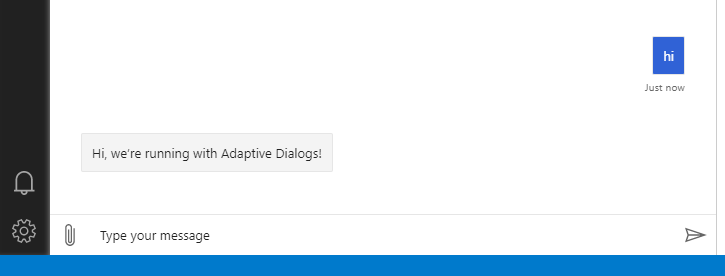
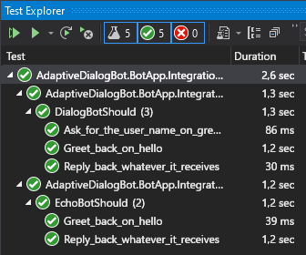

This is the second article in a series about Adaptive Dialogs in Bot Framework v4. It's an open-ended list at this point, so I'll update it as needed.

1. [Getting started with Adaptive Dialogs in Bot Framework v4](posts/../../getting-started-with-adaptive-dialogs-in-bot-framework-v4)
2. **Integration Testing with Adaptive Dialogs in Bot Framework v4** (This article)



## TL;DR;

In this article we get started with Adaptive Dialogs, setting a focus on integration testing. This is so, because integration testing can actually help you develop faster with Adaptive Dialogs.

This is the continuation from the [previous article](posts/../../getting-started-with-adaptive-dialogs-in-bot-framework-v4) but you can also start from a specific branch and complete the exercise just as well.

In this article we convert a simple echo bot created with the [Bot Framework Templates for Visual Studio (VS)](https://marketplace.visualstudio.com/items?itemName=BotBuilder.botbuilderv4) into an [Adaptive Dialogs](https://docs.microsoft.com/azure/bot-service/bot-builder-adaptive-dialog-introduction?view=azure-bot-service-4.0) bot.

In the process we'll work with:

- [Adaptive Expressions](https://docs.microsoft.com/azure/bot-service/bot-builder-concept-adaptive-expressions?view=azure-bot-service-4.0&tabs=arithmetic)
- [Language Generation](https://docs.microsoft.com/azure/bot-service/bot-builder-concept-language-generation?view=azure-bot-service-4.0&tabs=csharp)
- [Recognizers](https://docs.microsoft.com/azure/bot-service/bot-builder-concept-adaptive-dialog-recognizers?view=azure-bot-service-4.0) (Regex)
- Integration testing with Adaptive Dialogs

## Overview

If you whish, you can read a little bit of history/context about Adaptive Dialogs in the [previous article overview section](/posts/getting-started-with-adaptive-dialogs-in-bot-framework-v4).

You can think of Adaptive Dialogs like a new framework, built on top of Bot Framework, that uses Dialogs as the base class for a new set of key classes called **Actions**.

It might seem confusing at first, but the end result is a declarative framework that allows you to work faster, writing less boilerplate code.

In this article we will:

- Convert the echo bot from the previous article to an **Adaptive Dialogs** bot.
- Extend the initial integration test to use some dialog-specific test classes.
- Add language generators.
- Add a regex recognizer.
- Add a simple dialog to get some user information.

I'll be omitting the required "usings", at least most of the times. I'll also focus on the key parts of the code, you'll find all the details of each step in the repo, as separate issues, branches, and the related pull requests (PRs).

Let's get started 😀

## Implementation

### 1 - Switch to using Adaptive Dialogs

To add Adaptive Dialogs to a bot project, we have to:

1. Set up the project to use Adaptive Dialogs
2. Add dialogs
3. Add dialog testing classes

#### 1.1 - Set up the project for Adaptive Dialogs

We'll mostly follow the [Create a bot project for adaptive dialogs](https://docs.microsoft.com/azure/bot-service/bot-builder-adaptive-dialog-setup?view=azure-bot-service-4.0) article, but on our EchoBot project.

The article above starts by "registering components", but at this point it looks like this is only needed if you intend to use the [Bot Framework Composer](https://docs.microsoft.com/composer/introduction) with your bot. This is out of the scope of this article, so we can safely skip the component registration section, although I expect to give Composer a spin in at least one article in the series.

##### Create a branch for the post

Clone the repo and create a branch at tag `start-02`.

##### Add NuGet packages

We'll be using basic Adaptive Dialogs right now, so you just need to add this package to the bot project:

- `Microsoft.Bot.Builder.Dialogs.Adaptive`

##### Add a RootDialog

When using Adaptive Dialogs (and regular Dialogs too) it's a common practice to have a `RootDialog` that acts as a sort of top-level menu for the conversation.

There's also the convention to have all dialogs under the `Dialogs` folder, and then a folder for each dialog, with it's class inside. This dialog folder will be used later to have some dialog-related assets.

So, create a `Dialogs` folder with a `RootDialog` folder inside, and create the `RootDialog.cs` class inside, with the following code:


namespace AdaptiveDialogsBot.BotApp.Dialogs
{
    public class RootDialog : AdaptiveDialog
    {
        public RootDialog() : base(nameof(RootDialog))
        {
            Triggers = new List<OnCondition> {
                new OnUnknownIntent {
                    Actions = {
                        new SendActivity("Hi, we're running with Adaptive Dialogs!"),
                    }
                },
            };
        }
    }
}


In the code above:

- Take care to remove the trailing `.RootDialog` you'll get in the namespace (**line 1**), because of the `RootDialog` folder we're using. Otherwise you'll get conflicts between the class name and the namespace.
- Take a look at the `Triggers` property (**line 7**) and its `Actions` property (**line 9**). These are some of the key features that make developing with Adaptive Dialogs much more productive. We'll get deeper on this later on.
- Though not obvious here, all `Actions` (**line 9**) are also dialogs, so you can create specialized dialogs and use them just like that in Adaptive Dialogs.

##### Add a DialogBot

The `DialogBot` is another key component of Adaptive Dialogs, because it includes the use of the `DialogManager`. The `DialogManager` is mandatory for Adaptive Dialogs, and it can also manage regular old-fashioned dialogs.


public class DialogBot<T> : ActivityHandler
    where T : Dialog
{
    private readonly DialogManager DialogManager;
    protected readonly ILogger Logger;

    public DialogBot(
        T rootDialog, 
        ILogger<DialogBot<T>> logger)
    {
        Logger = logger;

        DialogManager = new DialogManager(rootDialog);
    }

    public override async Task OnTurnAsync(ITurnContext turnContext, CancellationToken cancellationToken = default)
    {
        Logger.LogInformation("Running dialog with Activity.");
        await DialogManager.OnTurnAsync(turnContext, cancellationToken: cancellationToken).ConfigureAwait(false);
    }
}


In the previous code you can see that:

- The root dialog is whatever dialog is injected into `DialogBot` (**line 8**).
- The `DialogManager` works with this root dialog (**line 13**).

##### Update the AdapterWithErrorHandler

The `ConversationState` is essential to `DialogManager`, and `DialogManager` expects to get it from the `TurnContext`, so we have to add it in the Adapter, as shown next:


public class AdapterWithErrorHandler : BotFrameworkHttpAdapter
{
    public AdapterWithErrorHandler(
        IConfiguration configuration,
        ILogger<BotFrameworkHttpAdapter> logger,
        ICredentialProvider credentialProvider,
        IStorage storage,
        UserState userState,
        ConversationState conversationState)
        : base(configuration, logger)
    {
        Use(new LoggingMiddleware());

        // These methods add middleware to the adapter. The middleware adds the storage and state objects to the
        // turn context each turn so that the dialog manager can retrieve them.
        this.UseStorage(storage);
        this.UseBotState(userState);
        this.UseBotState(conversationState);

        OnTurnError = async (turnContext, exception) =>
        {
            // Log any leaked exception from the application.
            logger.LogError(exception, $"[OnTurnError] unhandled error : {exception.Message}");

            // Send a message to the user
            await turnContext.SendActivityAsync("The bot encountered an error or bug.");
            await turnContext.SendActivityAsync("To continue to run this bot, please fix the bot source code.");

            // Send a trace activity, which will be displayed in the Bot Framework Emulator
            await turnContext.TraceActivityAsync("OnTurnError Trace", exception.Message, "https://www.botframework.com/schemas/error", "TurnError");
        };
    }
}


In the code above:

- You can see that the `Storage`, `UserState` and `ConversationState` are "registered" in the `TurnContext` as middlewares (**lines 16-18**), so they can be used by `DialogManager`.

##### Register the new bot and other support classes

We'll register all the new components into the dependency injection (DI) container so we can use them in our bot application, so update the `ConfigureServices` method in `Startup.cs` as follows:


public void ConfigureServices(IServiceCollection services)
{
    services.AddControllers().AddNewtonsoftJson();

    // Create the Bot Framework Adapter with error handling enabled.
    services.AddSingleton<IBotFrameworkHttpAdapter, AdapterWithErrorHandler>();

    // Create the bot. the ASP Controller is expecting an IBot.
    services.AddSingleton<IBot, DialogBot<RootDialog>>();

    // Create the credential provider to be used with the Bot Framework Adapter.
    services.AddSingleton<ICredentialProvider, ConfigurationCredentialProvider>();

    // Create the storage we'll be using for User and Conversation state. (Memory is great for testing purposes.) 
    services.AddSingleton<IStorage, MemoryStorage>();

    // Create the User state. (Used in this bot's Dialog implementation.)
    services.AddSingleton<UserState>();

    // Create the Conversation state. (Used by the Dialog system itself.)
    services.AddSingleton<ConversationState>();

    // The adaptive dialog that will be run by the bot.
    services.AddSingleton<RootDialog>();
}


In the previous code you can see that:

- `DialogBot<RootDialog>` has replaced `EchoBot` as the implementation for `IBot` (**line 9**), and that it does so as a `Singleton`, instead of as a `Transient` instance.
- We're using `MemoryStorage` as an implementation of `IStorage` (**line 15**), and this is fine for testing and demos but not for production, where you should use some persistent storage.

##### Run your new AdaptiveDialogsBot

You should be able to run your bot and test it with the Bot Emulator as shown next:

Keep in mind that, at this point, the bot doesn't respond on `ConversationUpdate`, so you'll have to take the initiative with a simple "**Hi**" 😉.

Also, current test don't pass either but we'll fix that right now

#### 1.2 - Update the bot to pass current tests

For this step we'll use the most naïve solution, without using some of the most interesting features of Adaptive Dialogs but that'll be just to pass the tests, we'll refactor the bot later.

##### Update RootDialog

So, to have the tests pass we'll use the `Triggers` and `Actions` mentioned before, by updating `RootDialog` as follows:


public class RootDialog : AdaptiveDialog
{
    public RootDialog() : base(nameof(RootDialog))
    {
        Triggers = new List<OnCondition> {
            new OnConversationUpdateActivity {
                Actions = {
                    new Foreach {
                        ItemsProperty = "turn.activity.membersAdded",
                        Actions = {
                            new IfCondition {
                                Condition = "$foreach.value.id != turn.activity.recipient.id",
                                Actions = {
                                    new SendActivity("Hello and welcome!")
                                }
                            }
                        }
                    }
                }
            },

            new OnUnknownIntent {
                Actions = {
                    new CodeAction(async (dialogContext, options) =>
                    {
                        string replyText;

                        if (dialogContext.Context.Activity.Text.Equals("Hello", StringComparison.OrdinalIgnoreCase))
                        {
                            var now = DateTime.Now.TimeOfDay;

                            var time = now < new TimeSpan(12, 0, 0)
                                ? "morning"
                                : now > new TimeSpan(19, 0, 0)
                                    ? "evening"
                                    : "afternoon";

                            replyText = "Good " + time;
                        }
                        else
                        {
                            replyText = $"Echo: {dialogContext.Context.Activity.Text}";
                        }

                        await dialogContext.Context.SendActivityAsync(MessageFactory.Text(replyText, replyText));

                        return await dialogContext.EndDialogAsync(options);
                    }),
                }
            },
        };
    }
}


In the code above:

- Notice that we're coding on the constructor (**line 3**), so this is actually a *declaration* or configuration of the dialog.
- We added the `OnConversationUpdateActivity` trigger (**line 6**) and the only action is a `Foreach` "loop" (**line 8**) on the `membersAdded` property of the incoming activity (**line 9**), and a greeting message is sent to the other members (**line 14**), those that are different from the recipient, that is, the bot itself (**line 12**).
- The `OnUnknownIntent` is the default intent, that will always be triggered now (**line 22**), since we haven't defined any recognizer.
- We almost copied, verbatim, the code from the original `EchoBot` in a `CodeAction` (**line 24**), that's just a lambda function (or delegate) that'll get invoked when necessary. You can actually set breakpoints in any `CodeAction`.
- A `CodeAction` **MUST** end with a `return await dialogContext.EndDialogAsync(options)` (**line 47**).

##### Add the state middleware to the TestAdapter

Update the `BotApplicationTestAdapter` as follows, so `DialogManager` can do its job:


public BotApplicationTestAdapter(
    ILogger<BotApplicationTestAdapter> logger,
    IStorage storage,
    UserState userState,
    ConversationState conversationState)
{
    Use(new LoggingMiddleware());

    this.UseStorage(storage);
    this.UseBotState(userState);
    this.UseBotState(conversationState);

    //...
}


In the code above:

- You can see that the state middlewares are added (**lines 9-11**) just as we did before on the `AdapterWithErrorHandler`.

You should be able to check that all tests complete successfully now.

### 2 - Add adaptive dialogs

In the previous section we added the adaptive `RootDialog` in a rather naïve way, mostly copying code from the `EchoBot`, so in this section we'll add a greeting dialog following "the Adaptive Dialogs way" 😉.

And we'll do it using TDD 😁

So we'll:

- Use the dialog test helpers classes.
- Use the Language Generation feature.
- Create a Regex recognizer
- Add a dialog to get user info

#### 2.1 - Use dialog test helper classes

We won't add any feature here, we'll just add a new dialog-oriented test class, just to check that our current bot passes a new, equivalent set of test.

We'll roughly follow the [How to unit test bots](https://docs.microsoft.com/azure/bot-service/unit-test-bots?view=azure-bot-service-4.0&tabs=csharp) official documentation although, as of April 2021, still doesn't cover adaptive dialogs.

##### Install required packages for testing

For this step we need to install the following packages:

- `Microsoft.Bot.Builder.Testing`
- `FluentAssertions`

##### Create a new dialog-based test class

Create a `DialogBotTests` folder with the test class `DialogBotShould`.

The class will implement `IClassFixture<BotApplicationFactory>` and `IDisposable` the same way as the `EchoBotShould` test class, actually the constructor and other private methods are identical, so we'll only review here the second test case in the class:


[Fact]
public async Task Greet_back_on_hello()
{
    // Arrange -----------------
    var testAdapter = GetService<TestAdapter>();
    testAdapter.Locale = "en-us";

    var dialogUnderTest = GetService<RootDialog>();
    var testClient = new DialogTestClient(testAdapter, dialogUnderTest);

    var conversationUpdate = Activity.CreateConversationUpdateActivity();
    conversationUpdate.MembersAdded.Add(testAdapter.Conversation.User);

    // Act ---------------------
    var reply = await testClient.SendActivityAsync<IMessageActivity>(conversationUpdate as Activity);
    reply.Text.Should().Be("Hello and welcome!");

    reply = await testClient.SendActivityAsync<IMessageActivity>("Hello");
    reply.Text.Should().BeOneOf(new[] {
        "Good morning",
        "Good afternoon",
        "Good evening"
    });

    // Assert ------------------
}


In the code above:

- We get the `TestAdapter` (**line 5**) and set the locale (**line 6**), just as with the `EchoBot` tests.
- We get the `RootDialog` instead of the whole bot (**line 8**), however, testing the root dialog is (almost) the same as testing the whole bot.
- We create a `DialogTestClient` (**line 9**) instead of the `TestFlow`, but we use a different overload for `DialogTestClient` from the one in the documentation, to make sure we use our `BotApplicationTestAdapter` that's already set up to handle adaptive dialogs.
- One interesting point of `DialogTestClient` is that it allows you to test dialogs individually, which can make testing easier.
- You can also assert for values at the end of each turn separately.
- The `DialogTestClient` API is more verbose (**lines 15, 18**), but you can easily create extension methods to type less.

#### 2.2 - Use the Language Generation feature

The [Language Generation](https://docs.microsoft.com/azure/bot-service/bot-builder-concept-language-generation?view=azure-bot-service-4.0&tabs=csharp) (LG) feature allows you to define templates with the output text, with all of the bot's replies, outside of the bot code, leveraging the capabilities of Adaptive Expressions.

The best way to edit LG templates is with VS Code and the [Bot Framework Adaptive Tools](https://marketplace.visualstudio.com/items?itemName=BotBuilder.bot-framework-adaptive-tools) extension and if you also install the [Open in Visual Studio Code](https://marketplace.visualstudio.com/items?itemName=MadsKristensen.OpeninVisualStudioCode) VS extension, you can just open the `Dialogs` folder with VS Code and get LG, LUIS and QnA Maker syntax highlighting, and even syntax checking for Adaptive Expressions in the LG templates.

##### Remove text from the bot code

Since the idea is to move all of the output text out of the code, we'll change text to **LG templates** references. This way we'll strip all "presentation-specific" code from the bot.

In this step we'll reference the templates file in the `RootDialog` and start using [AdaptiveExpressions](https://docs.microsoft.com/azure/bot-service/adaptive-expressions/adaptive-expressions-prebuilt-functions?view=azure-bot-service-4.0) and [adaptive dialog Actions](https://docs.microsoft.com/azure/bot-service/adaptive-dialog/adaptive-dialog-prebuilt-actions?view=azure-bot-service-4.0).

Update the `RoodDialog.cs` code as follows:


public class RootDialog : AdaptiveDialog
{
    public RootDialog(
        IHostEnvironment hostEnvironment)
        : base(nameof(RootDialog))
    {
        var dialogRoot = Path.Combine(hostEnvironment.ContentRootPath, "Dialogs");
        var templates = Templates.ParseFile(Path.Combine(dialogRoot, "RootDialog", "RootDialog.lg"));
        Generator = new TemplateEngineLanguageGenerator(templates);

        Triggers = new List<OnCondition> {
            new OnConversationUpdateActivity {
                Actions = {
                    new Foreach {
                        ItemsProperty = "turn.activity.membersAdded",
                        Actions = {
                            new IfCondition {
                                Condition = "$foreach.value.id != turn.activity.recipient.id",
                                Actions = {
                                    new SendActivity("${Welcome()}")
                                }
                            }
                        }
                    }
                }
            },

            new OnUnknownIntent {
                Actions = {
                    new IfCondition {
                        Condition = "toLower(turn.activity.text) == 'hello'",

                        Actions = {
                            new CodeAction(async (dialogContext, options) =>
                            {
                                var now = DateTime.Now.TimeOfDay;

                                var time = now < new TimeSpan(12, 0, 0)
                                    ? "morning"
                                    : now > new TimeSpan(19, 0, 0)
                                        ? "evening"
                                        : "afternoon";

                                dialogContext.State.SetValue("dialog.greetingTime", time);

                                return await dialogContext.EndDialogAsync(options);
                            }),

                            new SendActivity("${Greeting()}")
                        },

                        ElseActions = {
                            new SendActivity("${Echo()}")
                        }
                    },
                }
            },
        };
    }
}


In the code above:

- Get a reference to the `RootDialog.lg` (**line 8**), relative to the `ContentRoot` from the environment (**line 7**).
- Create a template-based generator from the `RootDialog.lg` file (**line 9**).
- Use the `Welcome()` template (**line 20**).
- Check for the "hello" utterance with an adaptive expression (**line 31**)
- Use te `CodeAction` only to set the value of the `dialog.greetingTime` property (**line 44**) so we can use the value in the LG templates.
- Use the `Greeting()` template (**line 49**) to reply to the "hello" utterance.
- Use the `Echo()` template (**line 53**) to reply to everything else

##### Create an LG file

As mentioned, the LG templates will only handle "presentation" logic.

Take a look at the [.lg file format documentation](https://docs.microsoft.com/azure/bot-service/file-format/bot-builder-lg-file-format?view=azure-bot-service-4.0) to learn its features.

Create the file `RootDialog.lg` with this content:


# Welcome
- Hello and welcome!

# Greeting
- SWITCH: ${dialog.greetingTime}
- CASE: ${'morning'}
    - Good morning
- CASE: ${'afternoon'}
    - Good afternoon
- DEFAULT:
    - Good evening

# Echo
- Echo: ${turn.activity.text}


In the template above you can see that:

- Templates are identified with a `#` (**lines 1, 4, 13**)
- State properties can be accessed from the templates (**lines 5, 14**)
- You can use some logic statements in the templates (**line 5**)

At this point your tests should complete successfully.

#### 2.3 - Use an intent recognizer and another dialog

The best way to handle intents in adaptive dialogs is using [recognizers](https://docs.microsoft.com/azure/bot-service/adaptive-dialog/adaptive-dialog-prebuilt-recognizers?view=azure-bot-service-4.0) and handling them with an `OnIntent` trigger.

You can create several types of recognizers, but in this article we'll go with [RegexRecognizers](https://docs.microsoft.com/azure/bot-service/adaptive-dialog/adaptive-dialog-prebuilt-recognizers?view=azure-bot-service-4.0#regexrecognizer)

We'll also add a greeting dialog that will be used when the `Greeting` intent is detected, to ask for the user name.

We'll use TDD to implement this.

##### Create a new test case

Create a new test case as follows:


[Fact]
public async Task Ask_for_the_user_name_on_greeting()
{
    // Arrange -----------------
    var testAdapter = GetService<TestAdapter>();
    testAdapter.Locale = "en-us";

    var dialogUnderTest = GetService<RootDialog>();
    var testClient = new DialogTestClient(testAdapter, dialogUnderTest);

    var conversationUpdate = Activity.CreateConversationUpdateActivity();
    conversationUpdate.MembersAdded.Add(testAdapter.Conversation.User);

    // Act ---------------------
    var reply = await testClient.SendActivityAsync<IMessageActivity>(conversationUpdate as Activity);
    reply.Text.Should().Be("Hello and welcome!");

    reply = await testClient.SendActivityAsync<IMessageActivity>("Hello");
    reply.Text.Should().BeOneOf(new[] {
        "Good morning",
        "Good afternoon",
        "Good evening"
    });

    reply = testClient.GetNextReply<IMessageActivity>();
    reply.Text.Should().Be("What's your name?");

    reply = await testClient.SendActivityAsync<IMessageActivity>("Miguel");
    reply.Text.Should().Be("Thanks Miguel 😊");

    // Assert ------------------
    var userName = testClient.DialogContext.State.GetStringValue("conversation.userName");
    userName.Should().Be("Miguel");
}


In the code above:

- We'll check that the user state has the the entered user name (**line 33**).

At this point the only failing test should be the one above. So we have to make it pass the test.

##### Create the GreetingDialog

Create the `GreetingDialog` class inside the `GreetingDialog` folder under `Dialogs` as follows:


public class GreetingDialog : AdaptiveDialog
{
    public GreetingDialog(
        IHostEnvironment hostEnvironment)
    {
        var dialogRoot = Path.Combine(hostEnvironment.ContentRootPath, "Dialogs");
        var templates = Templates.ParseFile(Path.Combine(dialogRoot, "GreetingDialog", "GreetingDialog.lg"));
        Generator = new TemplateEngineLanguageGenerator(templates);

        Triggers = new List<OnCondition> {
            new OnBeginDialog {
                Actions = {

                    new TextInput {
                        Property = "dialog.userName",
                        Prompt = new ActivityTemplate("${RequestUserName()}")
                    },

                    new SendActivity("${ThankUser()}"),

                    new EndDialog("=dialog.userName")
                }
            }
        };
    }
}


In the code above you can see that:

- The actions are executed when the dialog begins (**lines 11, 12**),
- The user is prompted for their name (**line 14**) and it's saved in the `userName` property of the current dialog (**line 15**).
- The return value from the dialog is taken from its `userName` property (**line 21**).

##### Create the GreetingDialog LG template

Now create the `GreetingDialog.lg` template as follows:


# RequestUserName
- What's your name?

# ThankUser
- Thanks ${dialog.userName} 😊


It the template above you can see that:

- The `userName` property from the dialog is used (**line 5**).

##### Create a recognizer for RootDialog

Create the `RootDialogRecognizer` in the `RootDialog` folder as follows:


public class RootDialogRecognizer : RegexRecognizer
{
    public RootDialogRecognizer()
    {
        Intents = new List<IntentPattern> {
            new IntentPattern {
                Intent = "Greeting",
                Pattern = "(Hi|Hello)"
            },
        };
    }
}


It the code above you can see that:

- A simple regex pattern is used for the `Greeting` intent (**line 8**).

##### Update the RootDialog

Update the RootDialog as follows:


public class RootDialog : AdaptiveDialog
{
    public RootDialog(
        IHostEnvironment hostEnvironment)
        : base(nameof(RootDialog))
    {
        var dialogRoot = Path.Combine(hostEnvironment.ContentRootPath, "Dialogs");
        var templates = Templates.ParseFile(Path.Combine(dialogRoot, "RootDialog", "RootDialog.lg"));
        Generator = new TemplateEngineLanguageGenerator(templates);

        Recognizer = new RootDialogRecognizer();

        Triggers = new List<OnCondition> {
            new OnConversationUpdateActivity {
                //...
            },

            new OnUnknownIntent {
                Actions = {
                    new SendActivity("${Echo()}")
                }
            },

            new OnIntent("Greeting") {
                Actions = {
                    new CodeAction(async (dialogContext, options) =>
                    {
                        var now = DateTime.Now.TimeOfDay;

                        var time = now < new TimeSpan(12, 0, 0)
                            ? "morning"
                            : now > new TimeSpan(19, 0, 0)
                                ? "evening"
                                : "afternoon";

                        dialogContext.State.SetValue("dialog.greetingTime", time);

                        return await dialogContext.EndDialogAsync(options);
                    }),

                    new SendActivity("${Greeting()}"),

                    new BeginDialog(nameof(GreetingDialog)) {
                        ResultProperty = "conversation.userName"
                    },
                }
            }
        };

        Dialogs.Add(new GreetingDialog(hostEnvironment));
    }
}


It the code above you can see that:

- The new `RootDialogRecognizer` is used (**line 11**).
- The `OnUnknownIntent` only uses the `Echo()` template (**line 20**).
- The new `OnIntent("Greeting")` trigger executes the greeting actions (**lines 24, 25**).
- The `GreetingDialog` is called (**line 43**) and its result is saved in the `conversation.userName` property (**line 44**).
- The `GreetingDialog` is added to the set of dialogs used by `RootDialog` (**line 50**).

##### Update the RootDialog LG template

We now have to use the user name in the greeting templates.

Update the `RootDialog.lg` file as follows:


# Welcome
- Hello and welcome!

# Greeting
- SWITCH: ${dialog.greetingTime}
- CASE: ${'morning'}
    - Good morning ${conversation.userName}
- CASE: ${'afternoon'}
    - Good afternoon ${conversation.userName}
- DEFAULT:
    - Good evening ${conversation.userName}

# Echo
- Echo: ${turn.activity.text}


It the template above you can see that:

- The `conversation.userName` property is simply used where needed (**lines 7, 9, 11**). If the property doesn't exist an empty string is generated (and the final output is trimmed!).

##### Update the TestAdapter registration

There's just a minor adjustment to make to the `TestAdapter` registration, because a singleton scope configuration causes some test case interferences.

Update the registration as follows:


public class BotApplicationFactory : WebApplicationFactory<Startup>
{
    //...

    protected override IHost CreateHost(IHostBuilder builder)
    {
        //...

        builder.ConfigureServices(services =>
        {
            services.AddScoped<TestAdapter, BotApplicationTestAdapter>();
        });

        return base.CreateHost(builder);
    }

    //...
}


It the code above you can see that:

- The scope was changed to `AddScoped` (**line 11**), to ensure each test case is run with a brand-new adapter.

At this point all test should complete successfully 😊

## Takeaways

In this post we've learned to:

- Convert a simple echo bot to an adaptive dialogs bot
- Use the **Triggers** and **Actions** key components of adaptive dialogs.
- Mix and match declarative dialog object declaration with **CodeActions** where you can add **and debug ** C# code.
- Use some dialog-based test helper classes with adaptive dialogs.
- Get and set state properties from both adaptive expressions and regular C# code.
- Use language generation templates.
- Use a regex recognizer and handle intents in adaptive dialogs.

I Hope you've found this post interesting and useful, and invite you to [follow me on Twitter](https://www.twitter.com/mvelosop) for posts and news.

You are also welcomed to leave a comment or ask a question [in the comments section below](#disqus_thread).

**Happy coding!**
