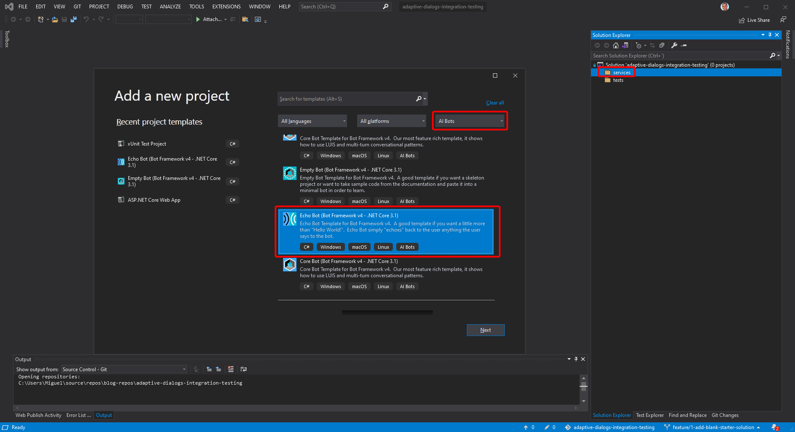
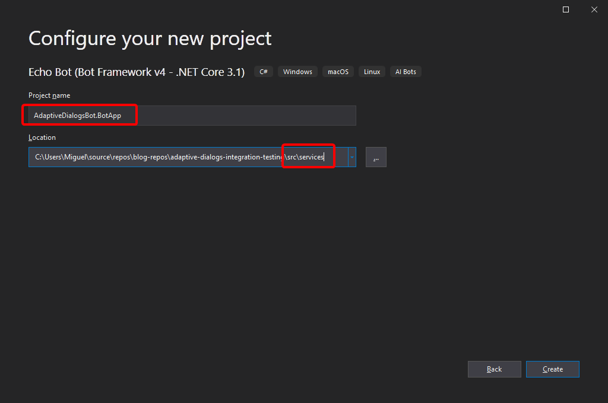
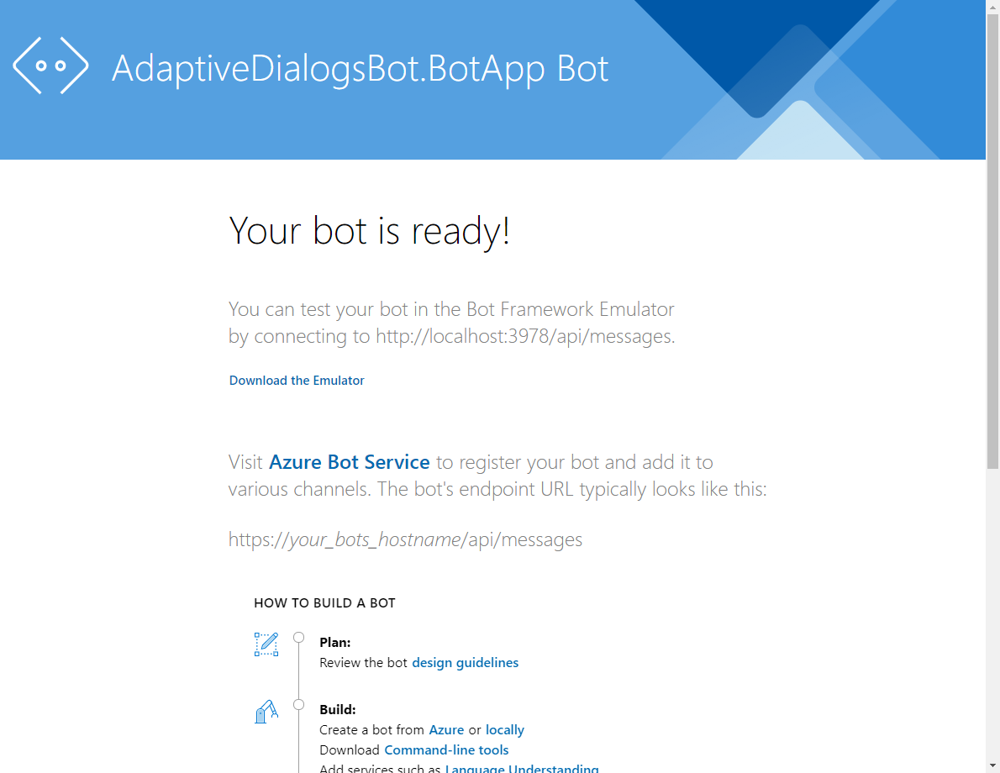
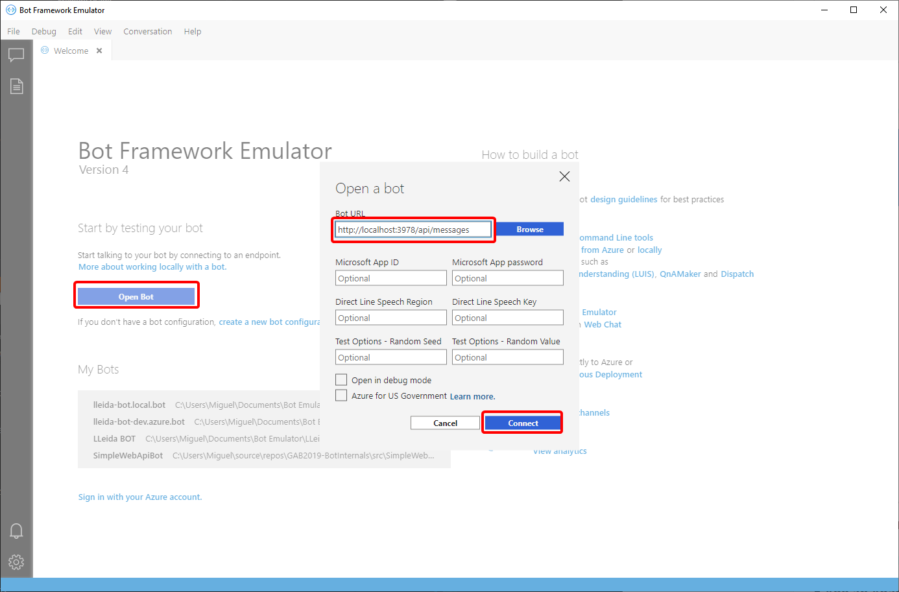
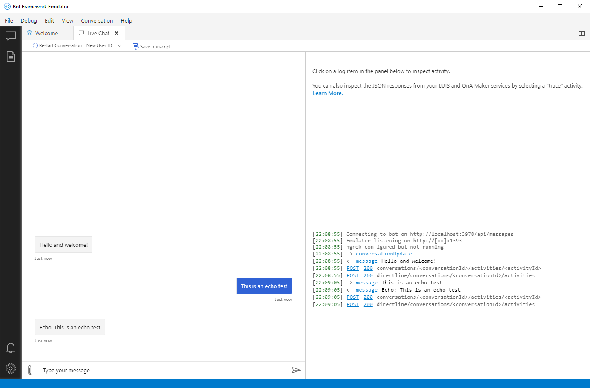
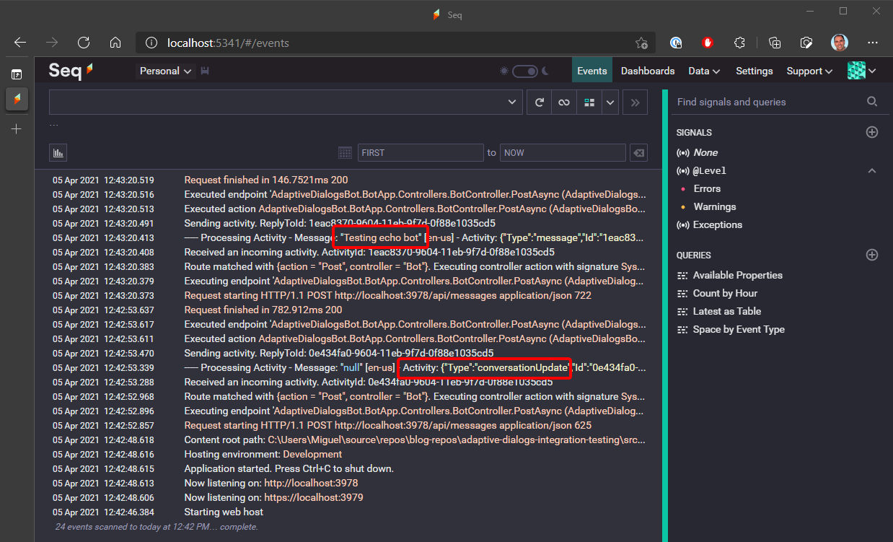
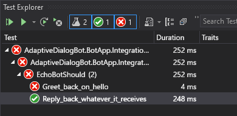
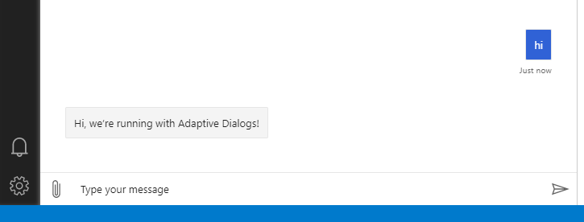

This is the first article in a series about Adaptive Dialogs in Bot Framework v4. I'm not sure how many posts it'll be so I'll leave it open-ended and update this list as needed.

1. **Integration Testing for Adaptive Dialogs in Bot Framework v4** (This article)



## TL;DR;

In this article we get started with Adaptive Dialogs, setting a focus on integration testing, that actually can help you accelerate bot development with Adaptive Dialogs.

The [Adaptive Dialogs](https://docs.microsoft.com/azure/bot-service/bot-builder-adaptive-dialog-introduction?view=azure-bot-service-4.0) technology includes the powerful [Adaptive Expressions](https://docs.microsoft.com/azure/bot-service/bot-builder-concept-adaptive-expressions?view=azure-bot-service-4.0) but there isn't a good-enough tooling support for Adaptive Expressions in Visual Studio, like Intellisense, so you end up **needing** tests to make sure your bot works as expected.

In a way, it's much like working with Javascript in Notepad but, in the end, Adaptive Dialogs and related technology are worth it!

## Overview

Adaptive Dialogs is a not too-recent Bot Framework technology that allows you to define dialogs in declarative fashion. This technology also includes Adaptive Expressions and Language Generator, and the whole set helps you writing much less boilerplate code to get the job done.

Adaptive Dialogs are at the core of the [Bot Framework Composer](https://docs.microsoft.com/composer/introduction), but you can also use them just by code which, by the way, is the focus on this article.

In this article we will:

- Create a simple echo bot using the [Bot Framework Templates for Visual Studio (VS)](https://marketplace.visualstudio.com/items?itemName=BotBuilder.botbuilderv4).
- Set up an integration tests project for the echo bot.
- Convert the echo bot to an Adaptive Dialogs bot
- Add a simple dialog to get some user information, making use of Adaptive Expressions, the RegexRecognizer, and Language Generation

## Implementation

In this article I'll focus on the key parts of the code, you'll find all the details of each step in the repo, as separate issues, branches, and the related pull requests (PRs).

We'll add logging as a fundamental component of any application but also as a learning resource.

### 1 - Create a simple echo bot with logging

In this step we'll create a starter bot setting up some solution folder structure to add the integration tests later on, so we'll:

1. Create a .NET Core 3.1 Echo bot
2. Add logging
3. Add a bot logging middleware

#### 1.1 - Create a .NET Core 3.1 Echo bot

Clone the repo and checkout the `feature/1-create-blank-starter-solution` branch.

Create a new project with the "**Echo Bot (Bot Framework v4 - .NET Core 3.1)**" template on the services solution folder:

Save the project as `AdaptiveDialogsBot.BotApp` and add the `services` folder to the path to mimic the solution structure:

At this point you should be able to run the bot with the bot emulator, that you can download from the link in the web application home page:

Just check for the latest release of the emulator.

Once you have the emulator installed, open the bot at `http://localhost:3978`:

You should be able to check the bot is running and echoing back whatever you type:

#### 1.2 - Add logging

We'll use [Serilog](https://serilog.net/) for logging and [Seq](https://datalust.co/seq) as a centralized log server.

Serilog is an open source product and [Seq is available for free](https://datalust.co/pricing) for development and small deployments.

You can install Seq either [on Windows](https://docs.datalust.co/docs/getting-started) [or Docker](https://docs.datalust.co/docs/getting-started-with-docker), whatever suits you better.

Following the instructions in the [Serilog.AspNetCore GitHub repo](https://github.com/serilog/serilog-aspnetcore#instructions), with a few small changes highlighted below.

Install the packages:

- `Serilog.AspNetCore`
- `Serilog.Sinks.Seq`
- `Destructurama.JsonNet`

Update all packages to the latest stable release, except for the ASP.NET Core related ones, that should be the latest 3.1.x.

Add Serilog and Seq to `Program.cs` as shown next.

Update `Main` in `Program.cs` as follows:


public static int Main(string[] args)
{
    Log.Logger = new LoggerConfiguration()
        .MinimumLevel.Override("Microsoft", LogEventLevel.Information)
        .Enrich.FromLogContext()
        .Destructure.JsonNetTypes()
        .WriteTo.Console()
        .WriteTo.Seq("http://localhost:5341")
        .CreateLogger();

    try
    {
        Log.Information("Starting web host");
        CreateHostBuilder(args).Build().Run();
        return 0;
    }
    catch (Exception ex)
    {
        Log.Fatal(ex, "Host terminated unexpectedly");
        return 1;
    }
    finally
    {
        Log.CloseAndFlush();
    }
}


In the previous code we::

- Added support to log JSon objects (**line 6**) when using the `@ObjectName` structured logging template.
- Added the Seq sink (**line 8**) to send log traces to Seq.

Next, update `CreateHostBuilder` as follows:


public static IHostBuilder CreateHostBuilder(string[] args) =>
Host.CreateDefaultBuilder(args)
    .UseSerilog()
    .ConfigureWebHostDefaults(webBuilder =>
    {
        webBuilder.UseStartup<Startup>();
    });


#### 1.3 - Add a bot logging middleware

We'll now add a simple logging middleware to the bot pipeline so we can log the activity details.

Create the `LoggingMiddleware` class as follows:


using Microsoft.Bot.Builder;
using Serilog;
using System.Threading;
using System.Threading.Tasks;

namespace AdaptiveDialogsBot.BotApp
{
    public class LoggingMiddleware : IMiddleware
    {
        public async Task OnTurnAsync(ITurnContext turnContext, NextDelegate next, CancellationToken cancellationToken = default)
        {
            Log.Information("----- Processing Activity - Message: \"{Message}\" [{Locale}] - Activity: {@Activity}",
                turnContext.Activity.Text, turnContext.Activity.Locale, turnContext.Activity);

            await next.Invoke(cancellationToken);
        }
    }
}


In the code above:

- Notice we're using `IMiddleware` from the `Microsoft.Bot.Builder` namespace (**lines 1, 8**).

Register the middleware in the `AdapterWithErrorHandler` class:


public class AdapterWithErrorHandler : BotFrameworkHttpAdapter
{
    public AdapterWithErrorHandler(IConfiguration configuration, ILogger<BotFrameworkHttpAdapter> logger)
        : base(configuration, logger)
    {
        Use(new LoggingMiddleware());

        OnTurnError = async (turnContext, exception) =>
        {
            // Log any leaked exception from the application.
            logger.LogError(exception, $"[OnTurnError] unhandled error : {exception.Message}");

            // Send a message to the user
            await turnContext.SendActivityAsync("The bot encountered an error or bug.");
            await turnContext.SendActivityAsync("To continue to run this bot, please fix the bot source code.");

            // Send a trace activity, which will be displayed in the Bot Framework Emulator
            await turnContext.TraceActivityAsync("OnTurnError Trace", exception.Message, "https://www.botframework.com/schemas/error", "TurnError");
        };
    }
}


In the code above:

We add the logging middleware to the adapter pipeline (**line 6**)

If you run the bot and test the emulator you should now get something like this in Seq:

### 2 - Add a bot test project

In this step we'll use ASP.NET Core's integration testing support to create the first integration test for the echo bot. So we'll:

1. Create an xUnit Test Project
2. Add the test server and other bot test-related classes
3. Add the echo test case
4. Do a little TDD

#### 2.1 - Create an xUnit Test Project and related infrastructure

Create a new **xUnit Test Project** in the `tests` solution folder, named `AdaptiveDialogBot.BotApp.IntegrationTests`, targeting .NET Core 3.1.

Remember to add `tests` to the project path, similar to what we did before, so the folder structure mimics the solution's.

Add a reference to the `AdaptiveDialogBot.BotApp` project.

Install the following packages:

- `Microsoft.Bot.Builder.Testing`
- `Microsoft.Extensions.DependencyInjection`
- `FluentAssertions`

Update all packages to the latest stable release, except for the ASP.NET Core related ones, that should be the latest 3.1.x.

Move the initial test class to a new `EchoBotTests` folder.

Rename the test class to `EchoBotShould` and update it so it looks like this:


using System;
using System.Threading.Tasks;
using Xunit;

namespace AdaptiveDialogBot.BotApp.IntegrationTests.EchoBotTests
{
    public class EchoBotShould
    {
        [Fact]
        public async Task Reply_back_whatever_it_receives()
        {
            // Arrange -----------------

            // Act ---------------------

            // Assert ------------------

        }
    }
}


#### 2.2 - Add test server and bot test-related classes

We'll roughly follow the [Integration tests in ASP.NET Core](https://docs.microsoft.com/aspnet/core/test/integration-tests) official article on integration tests, and some "old" testing classes from the Bot Framework.

Create the `Helpers` folder.

Create the `BotApplicationTestAdapter` class in the `Helper` folder with this code:


public class BotApplicationTestAdapter : TestAdapter
{
    public BotApplicationTestAdapter(
        ILogger<BotApplicationTestAdapter> logger)
    {
        Use(new LoggingMiddleware());

        OnTurnError = async (turnContext, exception) =>
        {
            // Log any leaked exception from the application.
            logger.LogError(exception, $"[OnTurnError] unhandled error : {exception.Message}");

            // Send a message to the user
            await turnContext.SendActivityAsync("The bot encountered an error or bug.");
            await turnContext.SendActivityAsync("To continue to run this bot, please fix the bot source code.");

            // Send a trace activity, which will be displayed in the Bot Framework Emulator
            await turnContext.TraceActivityAsync("OnTurnError Trace", exception.Message, "https://www.botframework.com/schemas/error", "TurnError");
        };

    }
}


In the code above:

- You can see that in looks just like the `AdapterWithErrorHandler` that we use in the bot project, only this one inherits from `TestAdapter` (**line 1**).
- It's using the same logging middleware (**line 6**), because we also want to log the test runs.

Create the `BotApplicationFactory` class in the same `Helpers` folder with the following code:


public class BotApplicationFactory : WebApplicationFactory<Startup>
{
    private bool _serverStarted;
    private bool _disposed;

    protected override IHost CreateHost(IHostBuilder builder)
    {
        Log.Logger = new LoggerConfiguration()
            .MinimumLevel.Override("Microsoft", LogEventLevel.Information)
            .Enrich.FromLogContext()
            .Destructure.JsonNetTypes()
            .WriteTo.Console()
            .WriteTo.Seq("http://localhost:5341")
            .CreateLogger();

        builder.UseSerilog();

        builder.ConfigureServices(services =>
        {
            services.AddSingleton<TestAdapter, BotApplicationTestAdapter>();
        });

        return base.CreateHost(builder);
    }

    public IServiceScope CreateScope()
    {
        EnsureServerStarted();
        return Services.CreateScope();
    }

    protected override void Dispose(bool disposing)
    {
        if (_disposed) return;

        if (disposing)
        {
            Log.CloseAndFlush();
        }

        _disposed = true;

        base.Dispose(disposing);
    }

    private void EnsureServerStarted()
    {
        if (_serverStarted) return;

        CreateClient();
        _serverStarted = true;
    }
}


In the code above you can see:

- We're inheriting from `WebApplicationFactory` referencing the bot project `Startup` class (**line 1**). This allows us to use the original `Startup` configurations, and change them here testing.
- Since we don't run any code from `Program.cs` we have to add the logging-related code here (**lines 8-16**)
- We're are registering the new `BotApplicationTestAdapter` (**line 20**).
- We're creating the `CreateScope` method (**line 26**), that we'll use in the tests methods to get classes from the DI container.
- Again, since we don't run any `Program.cs` we have to ensure the log cache is flushed when the test completes (**line 38**), otherwise you'll lose log traces.

Update the initial test class as follows:


public class EchoBotShould : IClassFixture<BotApplicationFactory>, IDisposable
{
    private bool _disposedValue;
    private readonly IServiceScope _scope;

    public EchoBotShould(BotApplicationFactory applicationFactory)
    {
        _scope = applicationFactory.CreateScope();
    }

    [Fact]
    public async Task Reply_back_whatever_it_receives()
    {
        // Arrange -----------------

        // Act ---------------------

        // Assert ------------------

    }

    private T GetService<T>() => _scope.ServiceProvider.GetRequiredService<T>();

    protected virtual void Dispose(bool disposing)
    {
        if (!_disposedValue)
        {
            if (disposing)
            {
                _scope.Dispose();
            }

            _disposedValue = true;
        }
    }

    public void Dispose()
    {
        // Do not change this code. Put cleanup code in 'Dispose(bool disposing)' method
        Dispose(disposing: true);
        GC.SuppressFinalize(this);
    }
}


In the code above:

- We set up the test class to accept a `BotApplicationFactory` in the constructor, [injected as a class fixture by the test framework](https://xunit.net/docs/shared-context#class-fixture) (**line 1**).
- We create a DI scope in the constructor (**line 8**), so we can use the DI container.
- The class is created as `IDisposable` (**line 1**) so we properly dispose the DI scope (**line 30**) using the [Dispose pattern](https://docs.microsoft.com/dotnet/standard/garbage-collection/implementing-dispose).

#### 2.3 - Add the initial echo test case

So we finally update the test class to include the actual test case, as follows:


[Fact]
public async Task Reply_back_whatever_it_receives()
{
    // Arrange -----------------
    var testAdapter = GetService<TestAdapter>();
    testAdapter.Locale = "en-us";

    var bot = GetService<IBot>();
    var testFlow = new TestFlow(testAdapter, bot);

    // Act ---------------------
    await testFlow
        .SendConversationUpdate()
        .AssertReply("Hello and welcome!")
        .Send("Echo TEST!")
        .AssertReply(activity => activity.AsMessageActivity().Text.Should().Be("Echo: Echo TEST!"))
        .StartTestAsync();

    // Assert ------------------
}


In the previous code:

- The `TestAdapter` is obtained from the DI container (**line 5**).
- The `EchoBot` is obtained from the DI container (**line 8**).
- The whole "conversation" is configured with some `TestFlow` methods (**lines 12-16**).
- You can do simple reply assertions (**line 14**).
- And you can also do any complex validation with a lambda function or a delegate (**line 16**).

#### 2.4 - Do a little TDD

So now that we have the whole test infrastructure set up, let's do some [Test Driven Development](https://en.wikipedia.org/wiki/Test-driven_development) (TDD).

Let's create a new test case as follows:


[Fact]
public async Task Greet_back_on_hello()
{
    // Arrange -----------------
    var testAdapter = GetService<TestAdapter>();
    testAdapter.Locale = "en-us";

    var bot = GetService<IBot>();
    var testFlow = new TestFlow(testAdapter, bot);

    // Act ---------------------
    await testFlow
        .SendConversationUpdate()
        .AssertReply("Hello and welcome!")
        .Send("Hello")
        .AssertReplyOneOf(new[] { 
            "Good morning",
            "Good afternoon",
            "Good evening"
        })
        .StartTestAsync();

    // Assert ------------------
}


This should be pretty obvious, so no details on the code above 😉

If you run the tests now you should get this:

By adding just a little code to the bot you can make the test pass:


public class EchoBot : ActivityHandler
{
    protected override async Task OnMessageActivityAsync(ITurnContext<IMessageActivity> turnContext, CancellationToken cancellationToken)
    {
        string replyText;

        if (turnContext.Activity.Text.Equals("Hello", StringComparison.OrdinalIgnoreCase))
        {
            var now = DateTime.Now.TimeOfDay;

            var time = now < new TimeSpan(12, 0, 0)
                ? "morning"
                : now > new TimeSpan(19, 0, 0)
                    ? "evening"
                    : "afternoon";

            replyText = "Good " + time;
        }
        else
        {
            replyText = $"Echo: {turnContext.Activity.Text}";
        }

        await turnContext.SendActivityAsync(MessageFactory.Text(replyText, replyText), cancellationToken);
    }

    //...
}


Again, pretty simple 😃

### 3 - Switch to using Adaptive Dialogs

So we've finally gotten to the Adaptive Dialogs section 😃

You can think of Adaptive Dialogs like a new bot framework built on top of Bot Framework using Dialogs as the base class for most of the new classes.

It might seem confusing at first, but the end result is a declarative framework that allows you to work faster, writing less boilerplate code.

To add Adaptive Dialogs, we have to:

1. Update the project to use Adaptive Dialogs
2. Add as many dialogs as needed
3. Add dialog testing classes

#### 3.1 - Convert the project for Adaptive Dialogs

We'll mostly follow the [Create a bot project for adaptive dialogs](https://docs.microsoft.com/azure/bot-service/bot-builder-adaptive-dialog-setup?view=azure-bot-service-4.0) article, but on our EchoBot project.

The article above starts by "registering components", but actually this is only needed if you intend to use the Bot Framework Composer with your bot. This is out of the scope of this article, so we can safely skip the component registration section.

##### Add NuGet packages

We'll be using basic Adaptive Dialogs, so you just need to add this package to the bot project:

- `Microsoft.Bot.Builder.Dialogs.Adaptive`

##### Add a RootDialog

When using Adaptive Dialogs (and regular Dialogs too) it's a common practice to have a `RootDialog` that acts as the top-level menu of the conversation.

There's also the convention to have all dialogs under the `Dialogs` folder, and then a folder for each dialog, with it's class inside. This dialog folder will be used later to have some dialog-related assets.

So, create a `Dialogs` folder with a `RootDialog` folder inside, and create the `RootDialog.cs` class inside, with the following code:


namespace AdaptiveDialogsBot.BotApp.Dialogs
{
    public class RootDialog : AdaptiveDialog
    {
        public RootDialog() : base(nameof(RootDialog))
        {
            Triggers = new List<OnCondition> {
                new OnUnknownIntent {
                    Actions = {
                        new SendActivity("Hi, we're running with Adaptive Dialogs!"),
                    }
                },
            };
        }
    }
}


In the code above:

- Take care to remove the trailing `.RootDialog` you'll get in the namespace (**line 1**), created from the `RootDialog` folder we're using. Otherwise you'll get conflicts between the class name and the namespace.
- Check see the `Triggers` property (**line 7**) and its `Actions` property (**line 9**). These are some of the key features that make developing with Adaptive Dialogs much more productive. We'll get deeper on this later on.
- Though not obvious here, all `Actions` (**line 9**) are also dialogs, so you can create specialized dialogs and use them just like that in Adaptive Dialogs.

##### Add a DialogBot

The `DialogBot` is another key component of Adaptive Dialogs, because it includes the use of the `DialogManager`. The `DialogManager` is mandatory for Adaptive Dialogs, and it can also manage regular old-fashioned dialogs.


public class DialogBot<T> : ActivityHandler
    where T : Dialog
{
    private readonly DialogManager DialogManager;
    protected readonly ILogger Logger;

    public DialogBot(
        T rootDialog, 
        ILogger<DialogBot<T>> logger)
    {
        Logger = logger;

        DialogManager = new DialogManager(rootDialog);
    }

    public override async Task OnTurnAsync(ITurnContext turnContext, CancellationToken cancellationToken = default)
    {
        Logger.LogInformation("Running dialog with Activity.");
        await DialogManager.OnTurnAsync(turnContext, cancellationToken: cancellationToken).ConfigureAwait(false);
    }
}


In the previous code:

- The root dialog is whatever dialog is injected into `DialogBot` (**line 8**).
- The `DialogManager` works with this root dialog (**line 13**).

##### Update the AdapterWithErrorHandler

The `ConversationState` is essential to `DialogManager`, and `DialogManager` expects to get it from the `TurnContext`, so we have to add it in the Adapter, as shown next:


public class AdapterWithErrorHandler : BotFrameworkHttpAdapter
{
    public AdapterWithErrorHandler(
        IConfiguration configuration,
        ILogger<BotFrameworkHttpAdapter> logger,
        ICredentialProvider credentialProvider,
        IStorage storage,
        UserState userState,
        ConversationState conversationState)
        : base(configuration, logger)
    {
        Use(new LoggingMiddleware());

        // These methods add middleware to the adapter. The middleware adds the storage and state objects to the
        // turn context each turn so that the dialog manager can retrieve them.
        this.UseStorage(storage);
        this.UseBotState(userState);
        this.UseBotState(conversationState);

        OnTurnError = async (turnContext, exception) =>
        {
            // Log any leaked exception from the application.
            logger.LogError(exception, $"[OnTurnError] unhandled error : {exception.Message}");

            // Send a message to the user
            await turnContext.SendActivityAsync("The bot encountered an error or bug.");
            await turnContext.SendActivityAsync("To continue to run this bot, please fix the bot source code.");

            // Send a trace activity, which will be displayed in the Bot Framework Emulator
            await turnContext.TraceActivityAsync("OnTurnError Trace", exception.Message, "https://www.botframework.com/schemas/error", "TurnError");
        };
    }
}


In the code above:

- You can see that the `Storage`, `UserState` and `ConversationState` are "registered" in the `TurnContext` as middlewares (**lines 16-18**), so they can be used by `DialogManager`.

##### Register the new bot and other support classes

We'll register all the new components into the DI container so we can use them in bot application, so update the `ConfigureServices` method in `Startup.cs` as follows:


public void ConfigureServices(IServiceCollection services)
{
    services.AddControllers().AddNewtonsoftJson();

    // Create the Bot Framework Adapter with error handling enabled.
    services.AddSingleton<IBotFrameworkHttpAdapter, AdapterWithErrorHandler>();

    // Create the bot. the ASP Controller is expecting an IBot.
    services.AddSingleton<IBot, DialogBot<RootDialog>>();

    // Create the credential provider to be used with the Bot Framework Adapter.
    services.AddSingleton<ICredentialProvider, ConfigurationCredentialProvider>();

    // Create the storage we'll be using for User and Conversation state. (Memory is great for testing purposes.) 
    services.AddSingleton<IStorage, MemoryStorage>();

    // Create the User state. (Used in this bot's Dialog implementation.)
    services.AddSingleton<UserState>();

    // Create the Conversation state. (Used by the Dialog system itself.)
    services.AddSingleton<ConversationState>();

    // The adaptive dialog that will be run by the bot.
    services.AddSingleton<RootDialog>();
}


In the previous code:

- You can see that `DialogBot<RootDialog>` has replaced `EchoBot` as the implementation for `IBot` (**line 9**), and that it does so as a `Singleton`, instead of as a `Transient` instance.
- Using `MemoryStorage` as an implementation of `IStorage` (**line 15**) is fine for testing and demos, but not for production, where you should use some persistent storage.

##### Run your new AdaptiveDialogsBot

You should be able to run your bot and test it with the Bot Emulator as shown next:

Keep in mind that, at this point, the bot doesn't respond on `ConversationUpdate`, so you'll have to take the initiative with a simple "**Hi**" 😉.

Also, current test don't pass either but we'll fix that right now

#### 3.2 - Update the bot to pass current tests

For this step we'll use the most naïve solution, without using some of the most interesting features of Adaptive Dialogs but that'll be just to pass the tests, and we'll fix that later.

##### Update RootDialog

So, we'll use the `Triggers` and `Actions` mentioned before, by updating `RootDialog` as follows:


public class RootDialog : AdaptiveDialog
{
    public RootDialog() : base(nameof(RootDialog))
    {
        Triggers = new List<OnCondition> {
            new OnConversationUpdateActivity {
                Actions = {
                    new Foreach {
                        ItemsProperty = "turn.activity.membersAdded",
                        Actions = {
                            new IfCondition {
                                Condition = "$foreach.value.id != turn.activity.recipient.id",
                                Actions = {
                                    new SendActivity("Hello and welcome!")
                                }
                            }
                        }
                    }
                }
            },

            new OnUnknownIntent {
                Actions = {
                    new CodeAction(async (dialogContext, options) =>
                    {
                        string replyText;

                        if (dialogContext.Context.Activity.Text.Equals("Hello", StringComparison.OrdinalIgnoreCase))
                        {
                            var now = DateTime.Now.TimeOfDay;

                            var time = now < new TimeSpan(12, 0, 0)
                                ? "morning"
                                : now > new TimeSpan(19, 0, 0)
                                    ? "evening"
                                    : "afternoon";

                            replyText = "Good " + time;
                        }
                        else
                        {
                            replyText = $"Echo: {dialogContext.Context.Activity.Text}";
                        }

                        await dialogContext.Context.SendActivityAsync(MessageFactory.Text(replyText, replyText));

                        return await dialogContext.EndDialogAsync(options);
                    }),
                }
            },
        };
    }
}


In the code above:

- Notice that we're coding on the constructor (**line 3**), so this is actually a *declaration* or configuration of the dialog.
- We added the `OnConversationUpdateActivity` trigger (**line 6**) and the only action is a `Foreach` "loop" (**line 8**) on the `membersAdded` property of the incoming activity (**line 9**), and a greeting message is sent to the other members (**line 14**), those that are different from the recipient, that is, the bot itself (**line 12**).
- The `OnUnknownIntent` is the default intent, that will always be triggered now (**line 22**), since we haven't defined any recognizer.
- We almost copied, verbatim, the code from the original `EchoBot` in a `CodeAction` (**line 24**), that's just a lambda function (or delegate) that'll get invoked when necessary. You can actually set breakpoints in any `CodeAction`.
- A `CodeAction` **MUST** end with a `return await dialogContext.EndDialogAsync(options)`.

##### Add the state middleware to the TestAdapter

Update the `BotApplicationTestAdapter` as follows, so `DialogManager` can do its job:


public BotApplicationTestAdapter(
    ILogger<BotApplicationTestAdapter> logger,
    IStorage storage,
    UserState userState,
    ConversationState conversationState)
{
    Use(new LoggingMiddleware());

    this.UseStorage(storage);
    this.UseBotState(userState);
    this.UseBotState(conversationState);

    //...
}


In the code above:

- You can see that the state middlewares are added (**lines 9-11**) just as we did before on the `AdapterWithErrorHandler`.

You should be able to check that all tests complete successfully now.

### 4 - Add adaptive dialogs

In the previous section we added the adaptive `RootDialog` in a rather naïve way, mostly copying code from the `EchoBot`, so in this section we'll add a greeting dialog following "the Adaptive Dialogs way" 😉. 

And we'll do it using TDD 😁

#### 4.1 - Use dialog test helper classes

We won't add any feature here, we'll just add a new dialog-oriented test class, just to check that our current bot passes a new, equivalent set of test.

We'll roughly follow the [How to unit test bots](https://docs.microsoft.com/azure/bot-service/unit-test-bots?view=azure-bot-service-4.0&tabs=csharp) official documentation although, as of April 2021, still doesn't cover adaptive dialogs.

##### Create a new dialog-based test class

Create a `DialogBotTests` folder with the test class `DialogBotShould`.

The class will implement `IClassFixture<BotApplicationFactory>` and `IDisposable` the same way as the `EchoBotShould` test class, actually the constructor and other private methods are identical, so we'll only review here only the second test case:


[Fact]
public async Task Greet_back_on_hello()
{
    // Arrange -----------------
    var testAdapter = GetService<TestAdapter>();
    testAdapter.Locale = "en-us";

    var dialogUnderTest = GetService<RootDialog>();
    var testClient = new DialogTestClient(testAdapter, dialogUnderTest);

    var conversationUpdate = Activity.CreateConversationUpdateActivity();
    conversationUpdate.MembersAdded.Add(testAdapter.Conversation.User);

    // Act ---------------------
    var reply = await testClient.SendActivityAsync<IMessageActivity>(conversationUpdate as Activity);
    reply.Text.Should().Be("Hello and welcome!");

    reply = await testClient.SendActivityAsync<IMessageActivity>("Hello");
    reply.Text.Should().BeOneOf(new[] {
        "Good morning",
        "Good afternoon",
        "Good evening"
    });

    // Assert ------------------
}


In the code above:

- We get the `TestAdapter` (**line 5**) and set the locale (**line 6**), just as with the `EchoBot` tests.
- We get the `RootDialog` instead of the whole bot (**line 8**), however testing the root dialog is (almost) the same as testing the whole bot.
- We create a `DialogTestClient` (**line 9**) instead of the `TestFlow`, but we se a different overload for `DialogTestClient` from the one in the documentation, to make sure we use our `BotApplicationTestAdapter` that's already set up to handle adaptive dialogs.
- One interesting point of `DialogTestClient` is that it allows you to test dialogs individually, which can make testing easier.
- You can also test each turn separately.
- The `DialogTestClient` API requires a more verbose code (**lines 15, 18**), but you can easily create extension methods to make it simpler.

#### 4.2 - Use the Language Generator (LG) feature

The Language Generator feature allows you to define templates with the output text, with all of the bot's replies, outside of the bot code.
You can define variants for the templates, so the bot can use any of them for a reply and can also be localized.

The best way to edit LG templates is with VS Code and the [Bot Framework Adaptive Tools](https://marketplace.visualstudio.com/items?itemName=BotBuilder.bot-framework-adaptive-tools)

##### Remove text from the bot code

Since the idea is to move all of the specific text out of the bot code, and will only handle "business" logic and no "presentation-specific" code.

In this step we'll reference the templates file in the `RootDialog` and start using [AdaptiveExpressions](https://docs.microsoft.com/azure/bot-service/adaptive-expressions/adaptive-expressions-prebuilt-functions?view=azure-bot-service-4.0) and [adaptive dialog Actions](https://docs.microsoft.com/azure/bot-service/adaptive-dialog/adaptive-dialog-prebuilt-actions?view=azure-bot-service-4.0)
Update the RoodDialog.cs code as follows:


public class RootDialog : AdaptiveDialog
{
    public RootDialog(
        IHostEnvironment hostEnvironment)
        : base(nameof(RootDialog))
    {
        var dialogRoot = Path.Combine(hostEnvironment.ContentRootPath, "Dialogs");
        var templates = Templates.ParseFile(Path.Combine(dialogRoot, "RootDialog", "RootDialog.lg"));
        Generator = new TemplateEngineLanguageGenerator(templates);

        Triggers = new List<OnCondition> {
            new OnConversationUpdateActivity {
                Actions = {
                    new Foreach {
                        ItemsProperty = "turn.activity.membersAdded",
                        Actions = {
                            new IfCondition {
                                Condition = "$foreach.value.id != turn.activity.recipient.id",
                                Actions = {
                                    new SendActivity("${Welcome()}")
                                }
                            }
                        }
                    }
                }
            },

            new OnUnknownIntent {
                Actions = {
                    new IfCondition {
                        Condition = "toLower(turn.activity.text) == 'hello'",

                        Actions = {
                            new CodeAction(async (dialogContext, options) =>
                            {
                                var now = DateTime.Now.TimeOfDay;

                                var time = now < new TimeSpan(12, 0, 0)
                                    ? "morning"
                                    : now > new TimeSpan(19, 0, 0)
                                        ? "evening"
                                        : "afternoon";

                                dialogContext.State.SetValue("dialog.greetingTime", time);

                                return await dialogContext.EndDialogAsync(options);
                            }),

                            new SendActivity("${Greeting()}")
                        },

                        ElseActions = {
                            new SendActivity("${Echo()}")
                        }
                    },
                }
            },
        };
    }
}


In the code above:

- Create a template-based generator from the `RootDialog.lg` file (**line 9**).
- Use the `ContentRoot` from the environment (**line 7**) so this also works while testing.
- Use the `Welcome()` template (**line 20**).
- Check for the "hello" utterance with an adaptive expression (**line 31**)
- Use te `CodeAction` only to set the value of the `dialog.greetingTime` property (**line 44**) so we can use it in the templates.
- Use the `Greeting()` template (**line 49**) to reply to the "hello" utterance.
- Use the `Echo()` template (**line 53**) to reply to everything else

##### Create an LG file

As mentioned, the LG templates will only handle "presentation" logic.

Take a look at the [.lg file format documentation](https://docs.microsoft.com/azure/bot-service/file-format/bot-builder-lg-file-format?view=azure-bot-service-4.0) to learn its features.

Create the file `RootDialog.lg` with this content:


# Welcome
- Hello and welcome!

# Greeting
- SWITCH: ${dialog.greetingTime}
- CASE: ${'morning'}
    - Good morning
- CASE: ${'afternoon'}
    - Good afternoon
- DEFAULT:
    - Good evening

# Echo
- Echo: ${turn.activity.text}


In the template above you can see that:

- Templates are identified with a `#` (**lines 1, 4, 13**)
- State properties can be accessed from the templates (**lines 5, 14**)
- You can use some logic statements in the templates (**line 5**)

At this point your tests should complete successfully.

#### 4.3 - Use an intent recognizer and another dialog

The best way to handle intents in adaptive dialogs is using [recognizers](https://docs.microsoft.com/azure/bot-service/adaptive-dialog/adaptive-dialog-prebuilt-recognizers?view=azure-bot-service-4.0) and handling them with an `OnIntent` trigger.

You can create several types of recognizers, but in this article we'll go with [RegexRecognizers](https://docs.microsoft.com/azure/bot-service/adaptive-dialog/adaptive-dialog-prebuilt-recognizers?view=azure-bot-service-4.0#regexrecognizer)

We'll also add a greeting dialog that will be used when the `Greeting` intent is detected, to ask for the user name.

We'll use TDD to implement this.

##### Create a new test case

Create a new test case as follows:


[Fact]
public async Task Ask_for_the_user_name_on_greeting()
{
    // Arrange -----------------
    var testAdapter = GetService<TestAdapter>();
    testAdapter.Locale = "en-us";

    var dialogUnderTest = GetService<RootDialog>();
    var testClient = new DialogTestClient(testAdapter, dialogUnderTest);

    var conversationUpdate = Activity.CreateConversationUpdateActivity();
    conversationUpdate.MembersAdded.Add(testAdapter.Conversation.User);

    // Act ---------------------
    var reply = await testClient.SendActivityAsync<IMessageActivity>(conversationUpdate as Activity);
    reply.Text.Should().Be("Hello and welcome!");

    reply = await testClient.SendActivityAsync<IMessageActivity>("Hello");
    reply.Text.Should().BeOneOf(new[] {
        "Good morning",
        "Good afternoon",
        "Good evening"
    });

    reply = testClient.GetNextReply<IMessageActivity>();
    reply.Text.Should().Be("What's your name?");

    reply = await testClient.SendActivityAsync<IMessageActivity>("Miguel");
    reply.Text.Should().Be("Thanks Miguel 😊");

    // Assert ------------------
    var userName = testClient.DialogContext.State.GetStringValue("conversation.userName");
    userName.Should().Be("Miguel");
}


In the code above:

- We'll check that the user state has the the entered user name (**line 33**).

At this point the only failing test should be the one above. So we have to make it pass the test.

##### Create the GreetingDialog

Create the `GreetingDialog` class inside the `GreetingDialog` folder under `Dialogs` as follows:


public class GreetingDialog : AdaptiveDialog
{
    public GreetingDialog(
        IHostEnvironment hostEnvironment)
    {
        var dialogRoot = Path.Combine(hostEnvironment.ContentRootPath, "Dialogs");
        var templates = Templates.ParseFile(Path.Combine(dialogRoot, "GreetingDialog", "GreetingDialog.lg"));
        Generator = new TemplateEngineLanguageGenerator(templates);

        Triggers = new List<OnCondition> {
            new OnBeginDialog {
                Actions = {

                    new TextInput {
                        Property = "dialog.userName",
                        Prompt = new ActivityTemplate("${RequestUserName()}")
                    },

                    new SendActivity("${ThankUser()}"),

                    new EndDialog("=dialog.userName")
                }
            }
        };
    }
}


In the code above you can see that:

- The actions are executed when the dialog begins (**lines 11, 12**),
- The user is prompted for their name (**line 14**) and it's saved in the `userName` property of the current dialog (**line 15**).
- The return value from the dialog is taken from its `userName` property (**line 21**).

##### Create the GreetingDialog LG template

Now create the `GreetingDialog.lg` template as follows:


# RequestUserName
- What's your name?

# ThankUser
- Thanks ${dialog.userName} 😊


It the template above you can see that:

- The `userName` property from the dialog is used (**line 5**).

##### Create a recognizer for RootDialog

Create the `RootDialogRecognizer` in the `RootDialog` folder as follows:


public class RootDialogRecognizer : RegexRecognizer
{
    public RootDialogRecognizer()
    {
        Intents = new List<IntentPattern> {
            new IntentPattern {
                Intent = "Greeting",
                Pattern = "(Hi|Hello)"
            },
        };
    }
}


It the code above you can see that:

- A simple regex pattern is used for the `Greeting` intent (**line 8**).

##### Update the RootDialog

Update the RootDialog as follows:


public class RootDialog : AdaptiveDialog
{
    public RootDialog(
        IHostEnvironment hostEnvironment)
        : base(nameof(RootDialog))
    {
        var dialogRoot = Path.Combine(hostEnvironment.ContentRootPath, "Dialogs");
        var templates = Templates.ParseFile(Path.Combine(dialogRoot, "RootDialog", "RootDialog.lg"));
        Generator = new TemplateEngineLanguageGenerator(templates);

        Recognizer = new RootDialogRecognizer();

        Triggers = new List<OnCondition> {
            new OnConversationUpdateActivity {
                //...
            },

            new OnUnknownIntent {
                Actions = {
                    new SendActivity("${Echo()}")
                }
            },

            new OnIntent("Greeting") {
                Actions = {
                    new CodeAction(async (dialogContext, options) =>
                    {
                        var now = DateTime.Now.TimeOfDay;

                        var time = now < new TimeSpan(12, 0, 0)
                            ? "morning"
                            : now > new TimeSpan(19, 0, 0)
                                ? "evening"
                                : "afternoon";

                        dialogContext.State.SetValue("dialog.greetingTime", time);

                        return await dialogContext.EndDialogAsync(options);
                    }),

                    new SendActivity("${Greeting()}"),

                    new BeginDialog(nameof(GreetingDialog)) {
                        ResultProperty = "conversation.userName"
                    },
                }
            }
        };

        Dialogs.Add(new GreetingDialog(hostEnvironment));
    }
}


It the code above you can see that:

- The new `RootDialogRecognizer` is used (**line 11**).
- The `OnUnknownIntent` only uses the `Echo()` template (**line 20**).
- The new `OnIntent("Greeting")` trigger takes care of the greeting actions (**lines 24, 25**).
- The `GreetingDialog` is called (**line 43**) and its result is saved in the `conversation.userName` property (**line 44**).
- The `GreetingDialog` is added to the set of dialogs used by `RootDialog`

##### Update the RootDialog LG template

We now have to use the user name in the greeting templates.

Update the `RootDialog.lg` file as follows:


# Welcome
- Hello and welcome!

# Greeting
- SWITCH: ${dialog.greetingTime}
- CASE: ${'morning'}
    - Good morning ${conversation.userName}
- CASE: ${'afternoon'}
    - Good afternoon ${conversation.userName}
- DEFAULT:
    - Good evening ${conversation.userName}

# Echo
- Echo: ${turn.activity.text}


It the template above you can see that:

- The `conversation.userName` property is simply used where needed (**lines 7, 9, 11**). If the property doesn't exist an empty string is generated (and the final output is trimmed!).

##### Update the TestAdapter registration

There's just a minor adjustment to make to the `TestAdapter` registration, because a singleton scope configuration causes some test case interferences.

Update the registration as follows:


public class BotApplicationFactory : WebApplicationFactory<Startup>
{
    //...

    protected override IHost CreateHost(IHostBuilder builder)
    {
        //...

        builder.ConfigureServices(services =>
        {
            services.AddScoped<TestAdapter, BotApplicationTestAdapter>();
        });

        return base.CreateHost(builder);
    }

    //...
}


It the code above you can see that:

- The scope was changed to `AddScoped` (**line 11**).

At this point all test should complete successfully 😊

## Takeaways
